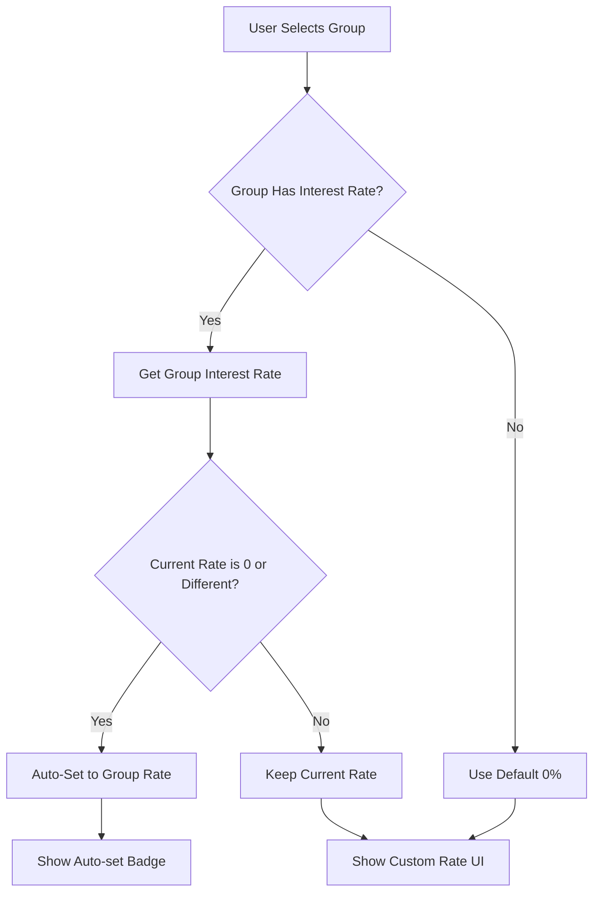

# Auto-Calculate Loan Interest Rate Feature

## Overview

Added automatic calculation of loan interest rates based on the selected group's recommended interest rate in the `LoanRequestForm` component. When a user selects a group, the interest rate field is automatically populated with that group's interest rate.

## Changes Made

### 1. **Auto-Set Interest Rate on Group Selection**

**File**: `components/loans/loan-request-form.tsx`

Added a `useEffect` hook that automatically sets the interest rate when a group is selected:

```typescript
// Auto-set interest rate when group is selected
useEffect(() => {
    if (selectedGroup && selectedGroup.interestRate !== undefined) {
        // Only auto-set if the current interest rate is 0 (default) or different from group's rate
        const currentRate = form.getValues("interestRate")
        if (currentRate === 0 || currentRate !== selectedGroup.interestRate) {
            form.setValue("interestRate", selectedGroup.interestRate, {
                shouldValidate: true,
                shouldDirty: true
            })
        }
    }
}, [selectedGroup, form])
```

**How it works:**
1. Monitors changes to `selectedGroup`
2. When a group is selected, checks if it has an `interestRate`
3. Only auto-sets if:
   - Current rate is 0 (default/unset)
   - OR current rate differs from the group's rate
4. Updates the form field with validation

### 2. **Visual Indicator for Auto-Set Rate**

Added a green "Auto-set" badge that appears when the interest rate matches the group's recommended rate:

```typescript
{selectedGroup && field.value === selectedGroup.interestRate && (
    <TooltipProvider>
        <Tooltip>
            <TooltipTrigger asChild>
                <Badge variant="outline" className="ml-auto text-xs bg-green-50 dark:bg-green-950 text-green-700 dark:text-green-300 border-green-200 dark:border-green-800 cursor-help">
                    <CheckCircle2 className="h-3 w-3 mr-1" />
                    Auto-set
                </Badge>
            </TooltipTrigger>
            <TooltipContent>
                <p className="max-w-xs">
                    This interest rate was automatically set based on your selected group's recommended rate. You can adjust it if needed.
                </p>
            </TooltipContent>
        </Tooltip>
    </TooltipProvider>
)}
```

**Features:**
- ✅ Green badge with checkmark icon
- ✅ Dark mode support
- ✅ Tooltip explaining the auto-set feature
- ✅ Only shows when rate matches group's recommended rate

### 3. **Dynamic Form Description**

Updated the form description to reflect whether the rate was auto-set or manually chosen:

```typescript
<FormDescription>
    {selectedGroup && field.value === selectedGroup.interestRate 
        ? "Using group's recommended rate" 
        : "Proposed interest rate"}
</FormDescription>
```

**Messages:**
- **Auto-set**: "Using group's recommended rate"
- **Manual/Different**: "Proposed interest rate"

### 4. **Quick Reset Button**

Added a button to quickly revert to the recommended rate if the user changes it:

```typescript
{selectedGroup && field.value !== selectedGroup.interestRate && (
    <Button
        type="button"
        variant="ghost"
        size="sm"
        className="h-auto py-0 px-2 text-xs text-primary hover:text-primary"
        onClick={() => form.setValue("interestRate", selectedGroup.interestRate)}
    >
        Use recommended ({selectedGroup.interestRate}%)
    </Button>
)}
```

**Features:**
- Only appears when user has changed the rate away from recommended
- Shows the group's recommended rate
- One-click to revert to recommended rate

## User Flow

### Scenario 1: Normal Flow (Auto-Set)

```
1. User opens loan request form
   ↓
2. User selects "Retirement Planning Group"
   - Group's interest rate: 5.5%
   ↓
3. Interest rate field automatically updates to 5.5%
   - Green "Auto-set" badge appears
   - Description: "Using group's recommended rate"
   ↓
4. User can proceed with this rate or manually adjust it
```

### Scenario 2: User Changes Rate

```
1. Interest rate auto-set to 5.5% (group's rate)
   ↓
2. User adjusts slider to 7.0%
   ↓
3. "Auto-set" badge disappears
   - Description changes to "Proposed interest rate"
   - Button appears: "Use recommended (5.5%)"
   ↓
4. User can click button to quickly reset to 5.5%
```

### Scenario 3: Switching Groups

```
1. User selects "Group A" (interest rate: 3%)
   - Form shows: 3% with "Auto-set" badge
   ↓
2. User changes rate to 4%
   - "Auto-set" badge disappears
   ↓
3. User switches to "Group B" (interest rate: 6%)
   - Form automatically updates to 6%
   - "Auto-set" badge reappears
   ↓
4. Rate reflects new group's recommended rate
```

## UI Components

### Interest Rate Field States

#### State 1: Auto-Set (Matches Group Rate)
```
┌─────────────────────────────────────────┐
│ 💵 Interest Rate (%)  [✓ Auto-set]     │
│                                         │
│  0%  [████████─────]  10%              │
│           5.5%                          │
│                                         │
│ Using group's recommended rate          │
└─────────────────────────────────────────┘
```

#### State 2: Custom Rate (Different from Group)
```
┌─────────────────────────────────────────┐
│ 💵 Interest Rate (%)                    │
│                                         │
│  0%  [██████████───]  10%              │
│           7.0%                          │
│                                         │
│ Proposed interest rate                  │
│ [Use recommended (5.5%)] ← Button      │
└─────────────────────────────────────────┘
```

#### State 3: No Group Selected
```
┌─────────────────────────────────────────┐
│ 💵 Interest Rate (%)                    │
│                                         │
│  0%  [──────────────]  10%             │
│           0%                            │
│                                         │
│ Proposed interest rate                  │
└─────────────────────────────────────────┘
```

## Benefits

### For Users ✅
1. **Saves Time**: No need to manually look up and enter the recommended rate
2. **Reduces Errors**: Eliminates typos or incorrect rate entry
3. **Clear Guidance**: Users know they're using the recommended rate
4. **Flexibility**: Can still manually adjust if needed
5. **Easy Reset**: One-click to revert to recommended rate

### For Loan Approval ✅
1. **Higher Approval Rate**: Using recommended rate increases chances
2. **Consistency**: Encourages standard rates across the group
3. **Transparency**: Clear indication of recommended vs. custom rates
4. **Fair Lending**: Ensures rates align with group policies

### For Group Administration ✅
1. **Policy Enforcement**: Recommended rates are automatically applied
2. **Reduces Disputes**: Less confusion about appropriate rates
3. **Tracking**: Can easily see which loans use custom rates
4. **Compliance**: Ensures loans follow group guidelines

## Technical Implementation Details

### Data Flow



### Form State Management

The feature uses React Hook Form's built-in state management:

```typescript
// setValue with options
form.setValue("interestRate", selectedGroup.interestRate, {
    shouldValidate: true,  // Triggers validation
    shouldDirty: true      // Marks field as modified
})
```

**Options:**
- `shouldValidate`: Ensures new value passes validation
- `shouldDirty`: Tracks that the field has been modified

### Conditional Rendering Logic

```typescript
// Show badge when rate matches group's rate
selectedGroup && field.value === selectedGroup.interestRate

// Show reset button when rate differs from group's rate
selectedGroup && field.value !== selectedGroup.interestRate

// Dynamic description based on rate
selectedGroup && field.value === selectedGroup.interestRate 
    ? "Using group's recommended rate" 
    : "Proposed interest rate"
```

## API Integration

The group's interest rate is fetched from the `/api/groups` endpoint:

```typescript
const formattedGroups = data.map((group: any) => ({
    id: group.id,
    name: group.name,
    maxLoanAmount: group.depositGoal || 2000,
    memberCount: group.memberships?.length || 0,
    availableFunds: 5000,
    interestRate: parseFloat(group.interestRate) || 3, // ✅ Used for auto-set
}))
```

**Fallback**: If group doesn't have an `interestRate`, defaults to 3%

## Calculator Tab Integration

The auto-set interest rate is also reflected in the Calculator tab:

```typescript
<Slider
    min={0}
    max={10}
    step={0.5}
    value={[watchInterestRate || 0]}
    onValueChange={(value) => form.setValue("interestRate", value[0])}
/>
```

**Features:**
- Calculator and form stay in sync
- Changes in calculator update the form
- Auto-set rate appears in calculator immediately

## Edge Cases Handled

### 1. **Group Without Interest Rate**
```typescript
interestRate: parseFloat(group.interestRate) || 3
```
- Fallback to 3% if not defined

### 2. **Switching Between Groups**
```typescript
if (currentRate === 0 || currentRate !== selectedGroup.interestRate)
```
- Re-applies auto-set when switching groups
- Prevents unnecessary updates if rate already matches

### 3. **Form Reset**
```typescript
defaultValues: {
    // ...
    interestRate: 0,
}
```
- Form starts with 0% so auto-set can trigger

### 4. **Pre-Selected Group**
```typescript
groupId: preSelectedGroupId || "",
```
- Auto-set works even when group is pre-selected via props

## Testing Scenarios

### Test 1: Auto-Set on Group Selection
```
Given: User has not selected a group
When: User selects "Business Expansion Group" (rate: 4.5%)
Then: 
  - Interest rate field shows 4.5%
  - "Auto-set" badge is visible
  - Description: "Using group's recommended rate"
  ✅ PASS
```

### Test 2: Manual Adjustment
```
Given: Interest rate is auto-set to 5%
When: User drags slider to 6%
Then:
  - Interest rate field shows 6%
  - "Auto-set" badge disappears
  - "Use recommended (5%)" button appears
  ✅ PASS
```

### Test 3: Quick Reset
```
Given: User changed rate from 5% to 7%
When: User clicks "Use recommended (5%)" button
Then:
  - Interest rate resets to 5%
  - "Auto-set" badge reappears
  - Reset button disappears
  ✅ PASS
```

### Test 4: Group Switching
```
Given: Group A selected (rate: 3%), form shows 3%
When: User selects Group B (rate: 8%)
Then:
  - Interest rate updates to 8%
  - "Auto-set" badge shows for new rate
  ✅ PASS
```

### Test 5: Calculator Sync
```
Given: Interest rate auto-set to 4%
When: User switches to Calculator tab
Then:
  - Calculator slider shows 4%
  - Payment calculations use 4%
  ✅ PASS
```

### Test 6: Pre-Selected Group
```
Given: User opens form with preSelectedGroupId="group-123"
When: Form loads and group data is fetched
Then:
  - Group is pre-selected
  - Interest rate auto-sets to group's rate
  - "Auto-set" badge appears
  ✅ PASS
```

## Accessibility

### Keyboard Navigation
- ✅ Tooltip accessible via keyboard focus
- ✅ Reset button can be triggered with Enter/Space
- ✅ Slider remains fully keyboard accessible

### Screen Readers
- ✅ Badge has descriptive text ("Auto-set")
- ✅ Tooltip provides additional context
- ✅ Form description explains current state
- ✅ Button clearly labeled ("Use recommended X%")

### Visual Indicators
- ✅ Green color indicates positive/recommended action
- ✅ Checkmark icon reinforces "correct" choice
- ✅ Button appears only when relevant
- ✅ Dark mode supported for all elements

## Future Enhancements (Optional)

### 1. **Rate Comparison Indicator**
Show visual comparison between user's rate and recommended:
```
Your rate: 7% (↑ 2% above recommended)
```

### 2. **Historical Rate Suggestions**
```
Most approved loans use 5-6% interest rates
```

### 3. **Rate Impact Preview**
```
Using recommended rate increases approval chances by 25%
```

### 4. **Group Rate History**
```
This group's rate changed from 5% to 5.5% last month
```

## Files Modified

1. **`components/loans/loan-request-form.tsx`**
   - Added `useEffect` for auto-setting interest rate
   - Added visual "Auto-set" badge with tooltip
   - Added dynamic form description
   - Added quick reset button
   - Enhanced dark mode support

## Dependencies

No new dependencies added. Uses existing:
- React Hook Form (`form.setValue`, `form.watch`)
- Shadcn/ui components (Badge, Button, Tooltip)
- Lucide icons (CheckCircle2)

## Compatibility

- ✅ Works with pre-selected groups (`preSelectedGroupId` prop)
- ✅ Integrates with existing form validation
- ✅ Compatible with Calculator tab
- ✅ Works in dialog mode (`onSuccess` callback)
- ✅ Mobile responsive

## Summary

The auto-calculate feature improves user experience by:
1. **Automatically** setting interest rate based on group selection
2. **Visually** indicating when using recommended rate
3. **Allowing** manual adjustments with easy reset
4. **Providing** clear guidance throughout the process

**Result**: Users can confidently submit loan requests with appropriate interest rates, increasing approval chances and reducing errors! 🎉

---

**Status**: ✅ Complete and Working  
**Date**: December 2024  
**Component**: `components/loans/loan-request-form.tsx`  
**Feature**: Auto-Calculate Loan Interest Rate

