# Dashboard & Services - Focused User Flow Diagram

## Overview
This document provides detailed user flow diagrams specifically for the Dashboard features and Services page in the Pollen Web application.

---

## Services Page - Complete User Flow

```mermaid
flowchart TD
    Start([User Visits Services Page]) --> Hero[Services Hero Section]
    
    Hero --> HeroActions{Hero Actions}
    HeroActions -->|Get Started| ServiceTabs
    HeroActions -->|Book Demo| BookDemo[Book a Demo]
    HeroActions -->|View Stats| ViewStats[View Platform Statistics]
    
    %% Main Services Tabs
    ServiceTabs[Services Tabs Section] --> SelectCategory{Select Service Category}
    
    SelectCategory -->|Digital Loans| DigitalLoans[Digital Loans Tab]
    SelectCategory -->|Village Banking| VillageBanking[Village Banking Tab]
    SelectCategory -->|Crypto Loans| CryptoLoans[Crypto Loans Tab]
    SelectCategory -->|Institution Banking| InstitutionBanking[Institution Banking Tab]
    
    %% Digital Loans Flow
    DigitalLoans --> DLContent[View Digital Loan Details]
    DLContent --> DLFeatures[View Key Features]
    DLFeatures --> DLList[See Feature List:<br/>- Quick approval<br/>- Flexible terms<br/>- Low interest rates<br/>- No collateral]
    
    DLContent --> LoanCalculator[Interactive Loan Calculator]
    LoanCalculator --> CalcSliders{Adjust Parameters}
    CalcSliders -->|Loan Amount| SetAmount[Set Amount K100-K10,000]
    CalcSliders -->|Loan Term| SetTerm[Set Term 3-36 months]
    SetAmount --> ViewPayment[View Monthly Payment]
    SetTerm --> ViewPayment
    ViewPayment --> ViewTotal[View Total Repayment]
    ViewTotal --> ViewRate[View Interest Rate: 5.9% APR]
    
    DLContent --> DLImage[View Application Progress Visual]
    DLImage --> ProgressInfo[Shows:<br/>- 5 min approval<br/>- Same-day funding]
    
    DLFeatures --> DLApply[Click Apply Now]
    ViewRate --> DLApply
    
    %% Village Banking Flow
    VillageBanking --> VBContent[View Village Banking Details]
    VBContent --> VBFeatures[View Key Features]
    VBFeatures --> VBList[See Feature List:<br/>- Community-backed<br/>- Blockchain secured<br/>- Democratic governance<br/>- Shared savings]
    
    VBContent --> VBImage[View Active Groups Visual]
    VBImage --> GroupsList[Shows Sample Groups:<br/>- Sunrise Savers<br/>- Unity Circle<br/>- Growth Collective<br/>- Future Fund]
    GroupsList --> GroupBenefits[View Benefits:<br/>- Community-backed<br/>- Blockchain secured]
    
    VBFeatures --> VBApply[Click Join a Group]
    
    %% Crypto Loans Flow
    CryptoLoans --> CLContent[View Crypto Loan Details]
    CLContent --> CLFeatures[View Key Features]
    CLFeatures --> CLList[See Feature List:<br/>- Use crypto as collateral<br/>- Keep crypto ownership<br/>- Fast approval<br/>- Competitive rates]
    
    CLFeatures --> CLApply[Click Apply Now]
    
    %% Institution Banking Flow
    InstitutionBanking --> IBContent[View Institution Banking Details]
    IBContent --> IBFeatures[View Key Features]
    IBFeatures --> IBList[See Feature List:<br/>- Business loans<br/>- Group financing<br/>- Institutional rates<br/>- Extended terms]
    
    IBFeatures --> IBApply[Click Learn More]
    
    %% Mobile Service Cards
    ServiceTabs --> MobileView{Mobile View?}
    MobileView -->|Yes| SwipeCards[Swipeable Service Cards]
    SwipeCards --> CardActions[Swipe Left/Right to Compare]
    CardActions --> ViewCard[View Service Card]
    ViewCard --> CardDetails[See:<br/>- Icon & Badge<br/>- Description<br/>- Key Features<br/>- Growth Stats]
    CardDetails --> CardApply[Click Apply Now]
    
    %% Comparison Table
    ServiceTabs --> ScrollDown[Scroll Down]
    ScrollDown --> ComparisonTable[Service Comparison Table]
    ComparisonTable --> TableView[View All Services in Table]
    TableView --> TableColumns[Compare:<br/>- Service Name<br/>- Ideal For<br/>- Key Features<br/>- Requirements]
    TableColumns --> TableApply[Click Apply from Table]
    
    %% How It Works Section
    ScrollDown --> HowItWorks[How It Works Section]
    HowItWorks --> Step1[Step 1: Create Profile]
    Step1 --> Step1Details[Sign up & AI builds<br/>blockchain identity]
    
    HowItWorks --> Step2[Step 2: Choose Service]
    Step2 --> Step2Details[Select loan or<br/>village banking option]
    
    HowItWorks --> Step3[Step 3: Access Funds & Grow]
    Step3 --> Step3Details[Receive funds &<br/>improve credit profile]
    
    Step1Details --> LearnMore1[Click Learn More]
    Step2Details --> LearnMore2[Click Learn More]
    Step3Details --> LearnMore3[Click Learn More]
    
    %% FAQ Section
    ScrollDown --> FAQ[FAQ Section]
    FAQ --> FAQAccordion[Click FAQ Question]
    FAQAccordion --> FAQTopics{Select Topic}
    FAQTopics -->|Blockchain| FAQ1[How blockchain improves<br/>village banking?]
    FAQTopics -->|Crypto| FAQ2[What crypto can be<br/>used as collateral?]
    FAQTopics -->|Interest| FAQ3[How are interest<br/>rates determined?]
    FAQTopics -->|Joining| FAQ4[How to join a<br/>village banking group?]
    FAQTopics -->|Repayment| FAQ5[What if can't repay<br/>on time?]
    FAQTopics -->|Security| FAQ6[Is data secure on<br/>blockchain?]
    
    FAQ1 --> ReadAnswer[Read Answer]
    FAQ2 --> ReadAnswer
    FAQ3 --> ReadAnswer
    FAQ4 --> ReadAnswer
    FAQ5 --> ReadAnswer
    FAQ6 --> ReadAnswer
    
    ReadAnswer --> ContactTeam[Still Have Questions?<br/>Click Contact Team]
    
    %% CTA Section
    ScrollDown --> CTA[Call-to-Action Section]
    CTA --> CTAActions{CTA Actions}
    CTAActions -->|Get Started| CTAStart[Click Get Started Now]
    CTAActions -->|Schedule Demo| CTADemo[Click Schedule Demo]
    CTAActions -->|View Metrics| CTAMetrics[View Success Metrics:<br/>- K25M+ Loans Disbursed<br/>- 1,200+ Village Groups<br/>- 4.8/5 User Satisfaction]
    
    %% Application Flow
    DLApply --> CheckAuth{User Authenticated?}
    VBApply --> CheckAuth
    CLApply --> CheckAuth
    IBApply --> CheckAuth
    CardApply --> CheckAuth
    TableApply --> CheckAuth
    CTAStart --> CheckAuth
    
    CheckAuth -->|No| SignIn[Redirect to Sign In]
    CheckAuth -->|Yes| ApplicationPage[Service Application Page]
    
    SignIn --> ClerkAuth[Clerk Authentication]
    ClerkAuth --> AuthSuccess{Auth Success?}
    AuthSuccess -->|Yes| ApplicationPage
    AuthSuccess -->|No| SignIn
    
    ApplicationPage --> FillForm[Fill Application Form]
    FillForm --> FormFields[Enter Details:<br/>- Service Type<br/>- Amount<br/>- Purpose<br/>- Repayment Period<br/>- Personal Info]
    FormFields --> UploadDocs[Upload Required Documents]
    UploadDocs --> ReviewApp[Review Application]
    ReviewApp --> SubmitApp[Submit Application]
    SubmitApp --> AppConfirm[Application Confirmation]
    AppConfirm --> DashboardRedirect[Redirect to Dashboard]
    
    %% Floating Action Button Mobile
    MobileView --> FAB[Floating Action Button]
    FAB --> FABMenu{FAB Menu}
    FABMenu -->|Apply for Loan| FABLoan[Quick Apply for Loan]
    FABMenu -->|Join Group| FABGroup[Quick Join Group]
    FABMenu -->|Contact Us| FABContact[Quick Contact]
    
    FABLoan --> CheckAuth
    FABGroup --> CheckAuth
    FABContact --> ContactPage[Contact Page]
```



---

## Dashboard - Complete User Flow

```mermaid
flowchart TD
    Start([User Logs In]) --> Dashboard[Dashboard Landing]
    
    Dashboard --> DashLayout[Dashboard Layout]
    DashLayout --> Sidebar[Left Sidebar Navigation]
    DashLayout --> MainContent[Main Content Area]
    DashLayout --> TopBar[Top Navigation Bar]
    
    %% Top Bar Features
    TopBar --> TopBarActions{Top Bar Actions}
    TopBarActions -->|Notifications| NotifBell[Notifications Bell]
    TopBarActions -->|User Menu| UserMenu[User Dropdown Menu]
    TopBarActions -->|Theme Toggle| ThemeToggle[Dark/Light Mode Toggle]
    TopBarActions -->|Language| LanguageSelect[Language Selector]
    
    NotifBell --> NotifCount[View Notification Count]
    NotifCount --> ClickNotif[Click Notifications]
    ClickNotif --> NotifPage[Navigate to Notifications Page]
    
    UserMenu --> UserOptions{User Options}
    UserOptions -->|Profile| EditProfile[Edit Profile]
    UserOptions -->|Settings| SettingsPage[Go to Settings]
    UserOptions -->|Sign Out| SignOut[Sign Out]
    
    %% Sidebar Navigation
    Sidebar --> SidebarMenu{Sidebar Menu}
    
    SidebarMenu -->|Dashboard| DashOverview[Dashboard Overview]
    SidebarMenu -->|Personal Savings| PersonalSavings[Personal Savings]
    SidebarMenu -->|Groups| GroupsPage[Groups]
    SidebarMenu -->|Loans| LoansPage[Loans]
    SidebarMenu -->|Payments| PaymentsPage[Payments]
    SidebarMenu -->|Deposit/Withdraw| DepositWithdraw[Deposit/Withdraw]
    SidebarMenu -->|View Balances| ViewBalances[View Balances]
    SidebarMenu -->|Notifications| NotificationsPage[Notifications]
    SidebarMenu -->|Settings| Settings[Settings]
    SidebarMenu -->|Help| Help[Help Center]
    
    %% Dashboard Overview Page
    DashOverview --> DashWidgets[Dashboard Widgets Grid]
    
    DashWidgets --> Widget1[Account Overview Widget]
    Widget1 --> W1Content[Shows:<br/>- Total Balance<br/>- Recent Activity<br/>- Quick Stats]
    
    DashWidgets --> Widget2[Recent Transactions Widget]
    Widget2 --> W2Content[Shows:<br/>- Last 5 transactions<br/>- Date, Type, Amount<br/>- View All link]
    
    DashWidgets --> Widget3[Savings Goals Widget]
    Widget3 --> W3Content[Shows:<br/>- Active Goals<br/>- Progress bars<br/>- Target amounts]
    
    DashWidgets --> Widget4[Group Contributions Widget]
    Widget4 --> W4Content[Shows:<br/>- Group balances<br/>- Upcoming contributions<br/>- Group count]
    
    DashWidgets --> Widget5[Quick Actions Widget]
    Widget5 --> QuickActions{Quick Actions}
    QuickActions -->|Send Money| SendMoneyModal[Send Money Modal]
    QuickActions -->|Request Money| RequestMoneyModal[Request Money Modal]
    QuickActions -->|Add Money| AddMoneyModal[Add Money Modal]
    QuickActions -->|Pay Bill| PayBillModal[Quick Bill Pay Modal]
    
    SendMoneyModal --> EnterRecipient[Enter Recipient Info]
    EnterRecipient --> EnterAmount[Enter Amount]
    EnterAmount --> ConfirmSend[Confirm & Send]
    ConfirmSend --> SendSuccess[Transaction Successful]
    
    RequestMoneyModal --> EnterRequester[Enter Requester Info]
    EnterRequester --> EnterReqAmount[Enter Amount]
    EnterReqAmount --> SendRequest[Send Request]
    
    AddMoneyModal --> SelectAddMethod[Select Method:<br/>- Mobile Money<br/>- Bank Transfer<br/>- Crypto]
    SelectAddMethod --> EnterAddAmount[Enter Amount]
    EnterAddAmount --> ConfirmAdd[Confirm Deposit]
    
    PayBillModal --> SelectBiller[Select Biller]
    SelectBiller --> EnterBillAmount[Enter Amount]
    EnterBillAmount --> ConfirmBill[Confirm Payment]
    
    DashWidgets --> Widget6[Financial Health Score]
    Widget6 --> W6Content[Shows:<br/>- Credit Score<br/>- Score Factors<br/>- Improvement Tips]
    
    DashWidgets --> Widget7[Analytics Chart]
    Widget7 --> W7Content[Shows:<br/>- Income vs Expenses<br/>- Savings Trend<br/>- Interactive Charts]
    
    %% Personal Savings Page
    PersonalSavings --> PSLayout[Personal Savings Layout]
    PSLayout --> PSBalance[Current Savings Balance]
    PSLayout --> PSGoals[Savings Goals List]
    PSLayout --> PSTransactions[Savings Transactions History]
    
    PSGoals --> GoalActions{Goal Actions}
    GoalActions -->|View Goal| ViewGoal[View Goal Details]
    GoalActions -->|Create Goal| CreateGoal[Create New Goal Modal]
    GoalActions -->|Edit Goal| EditGoal[Edit Goal Modal]
    GoalActions -->|Delete Goal| DeleteGoal[Delete Goal Confirm]
    GoalActions -->|Add Funds| AddFundsToGoal[Add Funds Modal]
    
    CreateGoal --> GoalForm[Goal Creation Form]
    GoalForm --> GoalFields[Enter:<br/>- Goal Name<br/>- Target Amount<br/>- Deadline<br/>- Description]
    GoalFields --> SaveGoal[Save Goal]
    SaveGoal --> GoalCreated[Goal Created Successfully]
    
    ViewGoal --> GoalDetails[View Goal Details]
    GoalDetails --> GoalProgress[View Progress:<br/>- Current Amount<br/>- Target Amount<br/>- Percentage Complete<br/>- Days Remaining]
    GoalDetails --> GoalTransactions[View Goal Transactions]
    
    AddFundsToGoal --> SelectSource[Select Fund Source:<br/>- Main Balance<br/>- External Deposit]
    SelectSource --> EnterFundAmount[Enter Amount]
    EnterFundAmount --> ConfirmFund[Confirm Transfer]
    ConfirmFund --> FundSuccess[Funds Added Successfully]
    
    %% Groups Page
    GroupsPage --> GroupsLayout[Groups Layout]
    GroupsLayout --> GroupTabs{Groups Tabs}
    
    GroupTabs -->|My Groups| MyGroups[My Groups List]
    GroupTabs -->|Create Group| CreateGroup[Create Group Flow]
    GroupTabs -->|Join Group| JoinGroup[Join Group Flow]
    GroupTabs -->|Saving Groups| SavingGroups[Saving Groups List]
    
    MyGroups --> GroupList[View Groups List]
    GroupList --> SelectGroup[Select a Group]
    SelectGroup --> GroupDetails[Group Details Page]
    
    GroupDetails --> GDLayout[Group Details Layout]
    GDLayout --> GDOverview[Group Overview Section]
    GDOverview --> GroupInfo[View:<br/>- Group Name<br/>- Total Balance<br/>- Member Count<br/>- Contribution Schedule]
    
    GDLayout --> GDMembers[Members Section]
    GDMembers --> MembersList[View Members List]
    MembersList --> MemberDetails[See Member Details:<br/>- Name<br/>- Role<br/>- Total Contributed<br/>- Current Balance]
    
    GDLayout --> GDContributions[Contributions Section]
    GDContributions --> ContActions{Contribution Actions}
    ContActions -->|View History| ContHistory[View Contribution History]
    ContActions -->|Make Contribution| MakeContribution[Make Contribution Modal]
    
    MakeContribution --> ContAmount[Enter Amount]
    ContAmount --> ContMethod[Select Payment Method]
    ContMethod --> ConfirmCont[Confirm Contribution]
    ConfirmCont --> ContSuccess[Contribution Successful]
    
    GDLayout --> GDMeetings[Meetings Section]
    GDMeetings --> MeetingsList[View Upcoming Meetings]
    MeetingsList --> MeetingDetails[View Meeting Details:<br/>- Date & Time<br/>- Location/Link<br/>- Agenda<br/>- Attendees]
    
    GDLayout --> GDLoans[Group Loans Section]
    GDLoans --> GroupLoanActions{Loan Actions}
    GroupLoanActions -->|View Requests| ViewLoanRequests[View Active Loan Requests]
    GroupLoanActions -->|Request Loan| RequestLoan[Request Group Loan]
    GroupLoanActions -->|Vote on Loan| VoteOnLoan[Vote on Pending Loans]
    
    %% Create Group Flow
    CreateGroup --> CGForm[Create Group Form]
    CGForm --> CGBasicInfo[Enter Basic Info:<br/>- Group Name<br/>- Description<br/>- Logo]
    CGBasicInfo --> CGSettings[Configure Settings:<br/>- Privacy (Public/Private)<br/>- Governance Type<br/>- Max Members]
    CGSettings --> CGContribution[Set Contribution Rules:<br/>- Amount<br/>- Frequency<br/>- Late Penalty<br/>- Grace Period]
    CGContribution --> CGAdvanced[Advanced Settings:<br/>- Interest Rate<br/>- Voting Threshold<br/>- Early Withdrawal Rules<br/>- Group Duration]
    CGAdvanced --> CGReview[Review Group Settings]
    CGReview --> CGCreate[Create Group]
    CGCreate --> CGSuccess[Group Created]
    CGSuccess --> InviteMembers[Invite Members]
    InviteMembers --> ShareCode[Share Group Code/Link]
    
    %% Join Group Flow
    JoinGroup --> JoinOptions{Join Method}
    JoinOptions -->|Browse| BrowseGroups[Browse Available Groups]
    JoinOptions -->|Code| EnterCode[Enter Group Code]
    JoinOptions -->|Invitation| AcceptInvite[Accept Invitation]
    
    BrowseGroups --> GroupFilters[Apply Filters:<br/>- Category<br/>- Contribution Amount<br/>- Frequency<br/>- Members Count]
    GroupFilters --> FilteredGroups[View Filtered Groups]
    FilteredGroups --> SelectToJoin[Select Group to Join]
    SelectToJoin --> ViewGroupInfo[View Group Information]
    ViewGroupInfo --> RequestToJoin[Request to Join]
    
    EnterCode --> ValidateCode[Validate Group Code]
    ValidateCode --> CodeValid{Code Valid?}
    CodeValid -->|Yes| ViewGroupInfo
    CodeValid -->|No| CodeError[Show Error]
    
    AcceptInvite --> ViewInvite[View Invitation Details]
    ViewInvite --> AcceptDecline{Accept or Decline?}
    AcceptDecline -->|Accept| JoinSuccess[Join Group Successfully]
    AcceptDecline -->|Decline| DeclineInvite[Decline Invitation]
    
    RequestToJoin --> JoinPending[Join Request Pending]
    JoinPending --> WaitApproval[Wait for Admin Approval]
    WaitApproval --> Approved{Approved?}
    Approved -->|Yes| JoinSuccess
    Approved -->|No| JoinRejected[Join Request Rejected]
    
    %% Loans Page
    LoansPage --> LoansLayout[Loans Page Layout]
    LoansLayout --> LoansTabs{Loans Tabs}
    
    LoansTabs -->|My Requests| MyLoanRequests[My Loan Requests]
    LoansTabs -->|Pending Approvals| PendingApprovals[Pending Approvals]
    LoansTabs -->|Active Loans| ActiveLoans[Active Loans]
    LoansTabs -->|Loan History| LoanHistory[Loan History]
    LoansTabs -->|New Request| NewLoanRequest[New Loan Request]
    
    MyLoanRequests --> MyLoansList[View My Loan Requests List]
    MyLoansList --> LoanCard[Click Loan Card]
    LoanCard --> LoanDetails[View Loan Details]
    LoanDetails --> LoanInfo[See:<br/>- Amount<br/>- Purpose<br/>- Status<br/>- Repayment Terms<br/>- Interest Rate<br/>- Votes]
    
    LoanInfo --> LoanStatus{Loan Status}
    LoanStatus -->|PENDING| ShowVotes[Show Votes Count:<br/>Approve vs Reject]
    LoanStatus -->|APPROVED| ShowApproval[Show Approval Date]
    LoanStatus -->|DISBURSED| ShowDisbursement[Show Disbursement Date<br/>& Repayment Schedule]
    LoanStatus -->|REPAYING| ShowRepayment[Show Repayment Progress:<br/>- Amount Paid<br/>- Amount Remaining<br/>- Next Due Date]
    LoanStatus -->|REPAID| ShowCompleted[Show Completion Date]
    LoanStatus -->|REJECTED| ShowRejection[Show Rejection Reason]
    LoanStatus -->|DEFAULTED| ShowDefault[Show Default Information]
    
    PendingApprovals --> PendingList[View Pending Loan Requests]
    PendingList --> SelectPending[Select Loan to Review]
    SelectPending --> ReviewLoan[Review Loan Details]
    ReviewLoan --> VoteOptions{Vote Options}
    VoteOptions -->|Approve| VoteApprove[Vote to Approve]
    VoteOptions -->|Reject| VoteReject[Vote to Reject]
    VoteApprove --> VoteComment[Add Optional Comment]
    VoteReject --> VoteComment
    VoteComment --> SubmitVote[Submit Vote]
    SubmitVote --> VoteSuccess[Vote Recorded]
    
    NewLoanRequest --> LoanRequestForm[Loan Request Form]
    LoanRequestForm --> SelectLoanGroup[Select Group]
    SelectLoanGroup --> LoanAmount[Enter Loan Amount]
    LoanAmount --> LoanPurpose[Enter Purpose]
    LoanPurpose --> RepaymentDate[Select Repayment Date]
    RepaymentDate --> RepaymentTerms[Enter Repayment Terms]
    RepaymentTerms --> Installments[Set Installments]
    Installments --> ReviewRequest[Review Loan Request]
    ReviewRequest --> SubmitRequest[Submit Request]
    SubmitRequest --> RequestSuccess[Request Submitted]
    RequestSuccess --> NotifyGroup[Group Members Notified]
    
    %% Payments Page
    PaymentsPage --> PaymentsLayout[Payments Page Layout]
    PaymentsLayout --> PaymentOptions{Payment Options}
    
    PaymentOptions -->|Send Money| SendMoney[Send Money]
    PaymentOptions -->|Request Money| RequestMoney[Request Money]
    PaymentOptions -->|Pay Bill| PayBill[Pay Bill]
    PaymentOptions -->|Top Up| TopUp[Top Up Account]
    PaymentOptions -->|Transaction History| TransactionHistory[Transaction History]
    
    SendMoney --> SMForm[Send Money Form]
    SMForm --> SMRecipient[Enter Recipient:<br/>- Phone/Email<br/>- Name]
    SMRecipient --> SMAmount[Enter Amount]
    SMAmount --> SMNote[Add Note Optional]
    SMNote --> SMReview[Review Transaction]
    SMReview --> SMConfirm[Confirm & Send]
    SMConfirm --> SMProcess[Processing]
    SMProcess --> SMResult{Transaction Result}
    SMResult -->|Success| SMSuccess[Payment Successful]
    SMResult -->|Failed| SMFailed[Payment Failed]
    
    TransactionHistory --> THFilters[Apply Filters:<br/>- Date Range<br/>- Type<br/>- Status<br/>- Amount Range]
    THFilters --> THList[View Transactions List]
    THList --> THDetails[View Transaction Details:<br/>- Reference<br/>- Date & Time<br/>- Type<br/>- Amount<br/>- Status<br/>- Description]
    THDetails --> THExport[Export Transactions]
    
    %% Deposit/Withdraw Page
    DepositWithdraw --> DWLayout[Deposit/Withdraw Page]
    DWLayout --> DWTabs{Transaction Type}
    
    DWTabs -->|Deposit| DepositTab[Deposit Tab]
    DWTabs -->|Withdraw| WithdrawTab[Withdraw Tab]
    
    DepositTab --> DepositMethods{Deposit Method}
    DepositMethods -->|Mobile Money| MoMoDeposit[Mobile Money Deposit]
    DepositMethods -->|Bank Transfer| BankDeposit[Bank Transfer]
    DepositMethods -->|Crypto| CryptoDeposit[Crypto Deposit]
    
    MoMoDeposit --> MDForm[Mobile Money Form]
    MDForm --> MDNumber[Enter Mobile Number]
    MDNumber --> MDAmount[Enter Amount]
    MDAmount --> MDProvider[Select Provider:<br/>- MTN<br/>- Airtel<br/>- Zamtel]
    MDProvider --> MDConfirm[Confirm Deposit]
    MDConfirm --> MDProcess[Processing]
    MDProcess --> MDPrompt[Prompt to Enter PIN<br/>on Phone]
    MDPrompt --> MDSuccess[Deposit Successful]
    
    WithdrawTab --> WithdrawMethods{Withdraw Method}
    WithdrawMethods -->|Mobile Money| MoMoWithdraw[Mobile Money Withdraw]
    WithdrawMethods -->|Bank Transfer| BankWithdraw[Bank Withdraw]
    WithdrawMethods -->|Crypto| CryptoWithdraw[Crypto Withdraw]
    
    MoMoWithdraw --> MWForm[Withdraw Form]
    MWForm --> MWNumber[Enter Mobile Number]
    MWNumber --> MWAmount[Enter Amount]
    MWAmount --> MWProvider[Select Provider]
    MWProvider --> MWConfirm[Confirm Withdrawal]
    MWConfirm --> MWProcess[Processing]
    MWProcess --> MWSuccess[Withdrawal Successful]
    
    %% View Balances Page
    ViewBalances --> VBLayout[View Balances Page]
    VBLayout --> BalanceCards[Balance Cards Grid]
    
    BalanceCards --> PersonalWallet[Personal Wallet Card]
    PersonalWallet --> PWBalance[Show:<br/>- Available Balance<br/>- Pending<br/>- Total]
    
    BalanceCards --> GroupBalances[Group Balances Card]
    GroupBalances --> GBList[List All Groups:<br/>- Group Name<br/>- My Balance<br/>- Total Group Balance]
    
    BalanceCards --> SavingsBalances[Savings Goals Card]
    SavingsBalances --> SBList[List All Goals:<br/>- Goal Name<br/>- Current Amount<br/>- Target Amount<br/>- Progress %]
    
    BalanceCards --> CryptoWallet[Crypto Wallet Card]
    CryptoWallet --> CWStatus{Wallet Connected?}
    CWStatus -->|No| ConnectWallet[Connect Celo Wallet Button]
    CWStatus -->|Yes| CWBalances[Show Balances:<br/>- CELO<br/>- cUSD<br/>- cEUR]
    
    ConnectWallet --> CeloConnect[Celo Connection Flow]
    CeloConnect --> WalletAuth[Authenticate Wallet]
    WalletAuth --> WalletConnected[Wallet Connected]
    WalletConnected --> CWBalances
    
    CWBalances --> CryptoActions{Crypto Actions}
    CryptoActions -->|Send Crypto| SendCrypto[Send Cryptocurrency]
    CryptoActions -->|Receive| ReceiveAddress[Show Receive Address]
    CryptoActions -->|Transactions| CryptoTX[View Crypto Transactions]
    
    %% Notifications Page
    NotificationsPage --> NotifLayout[Notifications Page Layout]
    NotifLayout --> NotifActions[Notification Actions]
    NotifActions --> MarkAllRead[Mark All as Read Button]
    
    NotifLayout --> NotifList[Notifications List]
    NotifList --> NotifItems[View Notification Items]
    NotifItems --> NotifTypes{Notification Type}
    
    NotifTypes -->|PAYMENT_DUE| PaymentDueNotif[Payment Due Notification]
    NotifTypes -->|PAYMENT_RECEIVED| PaymentReceivedNotif[Payment Received]
    NotifTypes -->|NEW_MEMBER| NewMemberNotif[New Member Joined]
    NotifTypes -->|MEETING_REMINDER| MeetingNotif[Meeting Reminder]
    NotifTypes -->|LOAN_REQUEST| LoanRequestNotif[Loan Request Notification]
    NotifTypes -->|LOAN_APPROVED| LoanApprovedNotif[Loan Approved]
    NotifTypes -->|LOAN_REJECTED| LoanRejectedNotif[Loan Rejected]
    NotifTypes -->|LOAN_REPAYMENT_DUE| RepaymentDueNotif[Repayment Due]
    NotifTypes -->|SYSTEM| SystemNotif[System Notification]
    
    NotifItems --> ClickNotifItem[Click Notification]
    ClickNotifItem --> NotifDetail[View Notification Details]
    NotifDetail --> NotifAction{Action Available?}
    NotifAction -->|Yes| TakeAction[Take Action:<br/>- Pay Now<br/>- View Loan<br/>- View Group<br/>- etc.]
    NotifAction -->|No| MarkRead[Mark as Read]
    
    %% Settings Page
    Settings --> SettingsLayout[Settings Page Layout]
    SettingsLayout --> SettingsSections{Settings Sections}
    
    SettingsSections -->|Profile| ProfileSettings[Profile Settings]
    SettingsSections -->|Account| AccountSettings[Account Settings]
    SettingsSections -->|Notifications| NotificationPrefs[Notification Preferences]
    SettingsSections -->|Security| SecuritySettings[Security Settings]
    SettingsSections -->|Language| LanguageSettings[Language Settings]
    SettingsSections -->|Theme| ThemeSettings[Theme Settings]
    SettingsSections -->|Wallet| WalletSettings[Wallet Settings]
    
    ProfileSettings --> ProfileForm[Edit Profile Form]
    ProfileForm --> ProfileFields[Update:<br/>- Name<br/>- Email<br/>- Phone<br/>- Avatar<br/>- Address]
    ProfileFields --> SaveProfile[Save Changes]
    
    NotificationPrefs --> NotifToggles[Notification Toggles]
    NotifToggles --> NotifChannels[Configure Channels:<br/>- Email<br/>- SMS<br/>- Push<br/>- In-App]
    NotifChannels --> NotifTypes2[Configure Types:<br/>- Payments<br/>- Loans<br/>- Groups<br/>- Marketing]
    NotifTypes2 --> SaveNotifPrefs[Save Preferences]
    
    SecuritySettings --> SecurityOptions[Security Options]
    SecurityOptions --> ChangePassword[Change Password]
    SecurityOptions --> TwoFactor[Two-Factor Authentication]
    SecurityOptions --> Sessions[Active Sessions]
    SecurityOptions --> DeleteAccount[Delete Account]
    
    LanguageSettings --> SelectLang[Select Language]
    SelectLang --> LangOptions[Available Languages:<br/>- English<br/>- French<br/>- Spanish<br/>- etc.]
    LangOptions --> ApplyLanguage[Apply Language]
    
    ThemeSettings --> ToggleThemeMode[Toggle Theme Mode]
    ToggleThemeMode --> ThemeOptions{Theme Options}
    ThemeOptions -->|Light| LightMode[Light Mode]
    ThemeOptions -->|Dark| DarkMode[Dark Mode]
    ThemeOptions -->|System| SystemMode[System Default]
    
    WalletSettings --> WalletOptions[Wallet Options]
    WalletOptions --> ConnectDisconnect[Connect/Disconnect Wallet]
    WalletOptions --> ViewWalletInfo[View Wallet Information]
    WalletOptions --> NetworkSelect[Select Network:<br/>- Alfajores Testnet<br/>- Mainnet]
    
    %% Help Center
    Help --> HelpLayout[Help Center Layout]
    HelpLayout --> HelpSections{Help Sections}
    HelpSections -->|FAQ| HelpFAQ[Frequently Asked Questions]
    HelpSections -->|Guides| HelpGuides[User Guides]
    HelpSections -->|Contact| HelpContact[Contact Support]
    HelpSections -->|Resources| HelpResources[Resources & Documentation]
    
    HelpFAQ --> FAQCategories[FAQ Categories]
    FAQCategories --> SearchFAQ[Search FAQ]
    SearchFAQ --> ViewFAQAnswer[View FAQ Answer]
    
    HelpContact --> ContactForm[Contact Support Form]
    ContactForm --> SubmitTicket[Submit Support Ticket]
```

---

## Dashboard Overview - Widget Details

### Available Widgets

1. **Account Overview**
   - Total balance across all accounts
   - Quick balance display
   - Visual balance indicator

2. **Recent Transactions**
   - Last 5-10 transactions
   - Transaction type icons
   - Click to view full history

3. **Savings Goals**
   - Progress bars for each goal
   - Percentage completion
   - Quick add funds button

4. **Group Contributions**
   - All groups listed
   - Contribution status
   - Upcoming dues

5. **Quick Actions** (Modal Triggers)
   - Send Money
   - Request Money
   - Add Money
   - Pay Bill

6. **Financial Health Score**
   - Credit score display
   - Score breakdown
   - Improvement recommendations

7. **Analytics Dashboard**
   - Income vs Expenses chart
   - Savings trend
   - Spending categories

8. **Notifications Preview**
   - Unread notification count
   - Latest notifications
   - Link to full notifications page

9. **Upcoming Events**
   - Group meetings
   - Payment due dates
   - Goal deadlines

---

## Services Page - Service Categories

### Digital Loans
**Features:**
- Quick 5-minute approval
- Same-day funding
- No collateral required
- Flexible repayment terms
- Interest rate: 5.9% APR
- Interactive loan calculator
- Loan amount: K100 - K10,000
- Loan term: 3-36 months

**Application Process:**
1. Click "Apply Now"
2. Authenticate (if not logged in)
3. Fill application form
4. Upload documents (NRC, Payslip, Proof of Address)
5. Submit and wait for approval

### Village Banking
**Features:**
- Community-backed lending
- Blockchain-secured transactions
- Democratic governance
- Shared savings pool
- Group loan approvals
- Lower interest rates

**Groups Available:**
- Sunrise Savers
- Unity Circle
- Growth Collective
- Future Fund

**Join Process:**
1. Browse available groups
2. View group details
3. Request to join or enter group code
4. Wait for admin approval
5. Start contributing

### Crypto Loans
**Features:**
- Use crypto as collateral
- Keep crypto ownership
- Fast approval process
- Competitive interest rates
- Supported: BTC, ETH, stablecoins

### Institution Banking
**Features:**
- Business loans
- Group financing solutions
- Institutional interest rates
- Extended repayment terms
- Higher loan amounts

---

## Key Interactions Summary

### Dashboard Quick Actions
1. **Send Money**: Instant money transfer to other users
2. **Request Money**: Request payment from other users
3. **Add Money**: Deposit via Mobile Money, Bank, or Crypto
4. **Pay Bill**: Quick bill payment feature

### Services Page Interactions
1. **Interactive Loan Calculator**: Real-time calculation of monthly payments
2. **Service Comparison**: Side-by-side service comparison table
3. **Mobile Swipe Cards**: Swipeable service cards on mobile devices
4. **FAQ Accordion**: Expandable FAQ sections
5. **CTA Buttons**: Multiple call-to-action entry points

### Navigation Patterns
- **Sidebar**: Main navigation on desktop
- **Bottom Nav**: Main navigation on mobile
- **Breadcrumbs**: Page hierarchy navigation
- **Back Buttons**: Return to previous pages
- **Tabs**: Section switching within pages

---

This focused flow diagram provides complete detail on Dashboard features and the Services page functionality.

