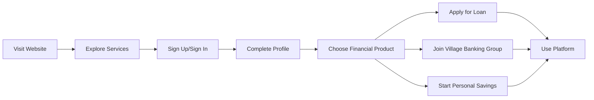
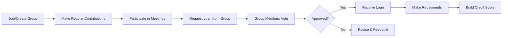
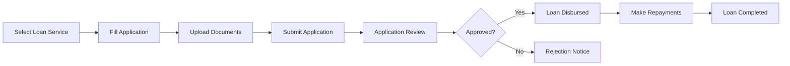
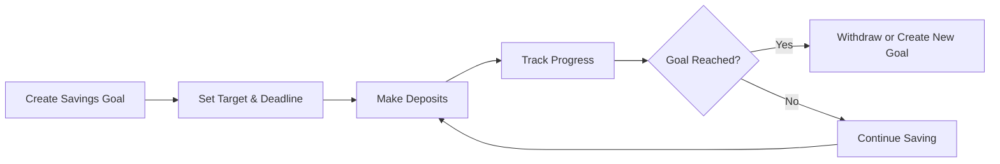
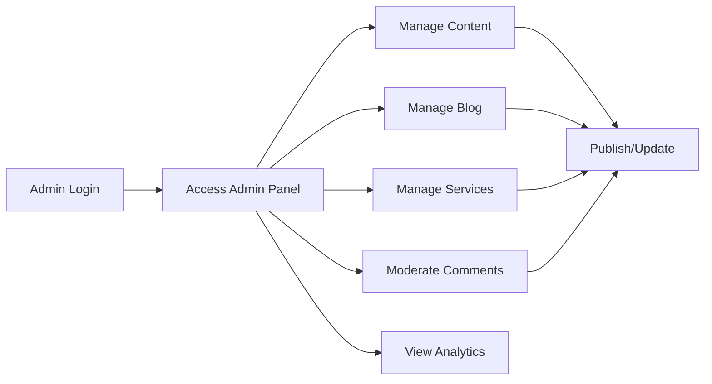
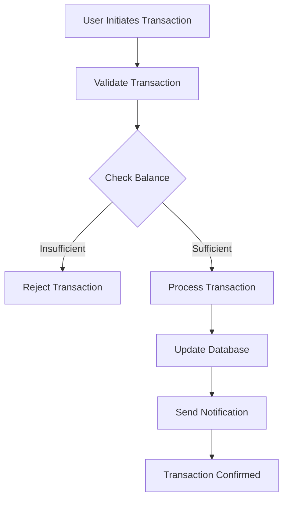
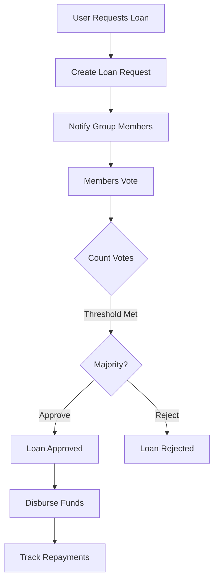
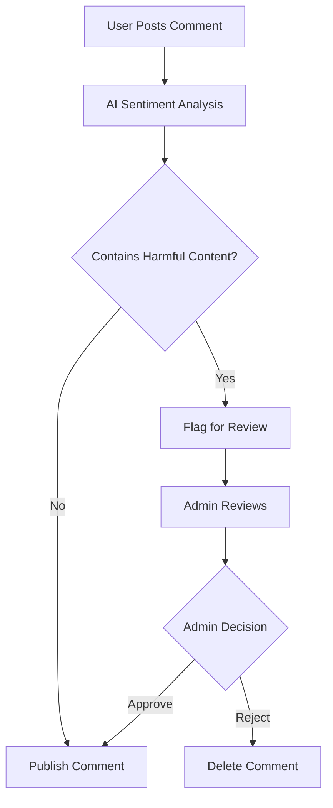

# Pollen Web - Complete User Flow Diagram

## Overview
This document contains comprehensive user flow diagrams for the Pollen Web application, a blockchain-powered financial services platform offering digital loans, village banking, personal savings, and crypto-based financial services.

---

## Main User Flow Diagram

```mermaid
flowchart TD
    Start([User Visits Pollen Web]) --> Landing[Landing Page]
    
    Landing --> PublicPages{Choose Action}
    PublicPages -->|Learn More| About[About Page]
    PublicPages -->|View Services| Services[Services Page]
    PublicPages -->|Read Blog| Blog[Blog Page]
    PublicPages -->|Contact| Contact[Contact Page]
    PublicPages -->|View Testimonials| Testimonials[Testimonials Page]
    PublicPages -->|View Innovations| Innovations[Innovations Page]
    PublicPages -->|Get Started| SignIn[Sign In / Sign Up]
    
    %% Services Flow
    Services --> ServiceTypes{Select Service Type}
    ServiceTypes -->|Digital Loans| DigitalLoans[Digital Loans Info]
    ServiceTypes -->|Village Banking| VillageBanking[Village Banking Info]
    ServiceTypes -->|Crypto Loans| CryptoLoans[Crypto Loans Info]
    ServiceTypes -->|Institution Banking| InstitutionLoans[Institution Banking Info]
    
    DigitalLoans --> ServiceApply[Service Application Page]
    VillageBanking --> ServiceApply
    CryptoLoans --> ServiceApply
    InstitutionLoans --> ServiceApply
    
    ServiceApply --> RequiresAuth{User Authenticated?}
    RequiresAuth -->|No| SignIn
    RequiresAuth -->|Yes| ApplicationForm[Fill Application Form]
    
    %% Blog Flow
    Blog --> BlogList[View Blog Posts]
    BlogList --> BlogPost[Read Blog Post]
    BlogPost --> BlogActions{Blog Actions}
    BlogActions -->|Like| LikeBlog[Like Post]
    BlogActions -->|Comment| CommentBlog[Add Comment]
    BlogActions -->|Bookmark| BookmarkBlog[Bookmark Post]
    BlogActions -->|Share| ShareBlog[Share Post]
    BlogActions -->|Follow Author| FollowAuthor[Follow Author]
    
    CommentBlog --> VoiceComment{Comment Type?}
    VoiceComment -->|Text| TextComment[Submit Text Comment]
    VoiceComment -->|Voice| AudioComment[Record & Submit Voice Comment]
    
    %% Contact Flow
    Contact --> ContactForm{Contact Type}
    ContactForm -->|Send Message| SubmitMessage[Submit Contact Message]
    ContactForm -->|Book Meeting| ScheduleMeeting[Schedule Meeting]
    
    SubmitMessage --> DepartmentSelect[Select Department]
    DepartmentSelect --> SendMessage[Send Message]
    
    %% Authentication Flow
    SignIn --> ClerkAuth[Clerk Authentication]
    ClerkAuth --> AuthSuccess{Auth Successful?}
    AuthSuccess -->|Yes| Dashboard[Dashboard]
    AuthSuccess -->|No| SignIn
    
    %% Dashboard Main Flow
    Dashboard --> DashboardMenu{Dashboard Menu}
    
    DashboardMenu -->|Overview| DashOverview[Dashboard Overview]
    DashboardMenu -->|Personal Savings| PersonalSavings[Personal Savings]
    DashboardMenu -->|Groups| Groups[Village Banking Groups]
    DashboardMenu -->|Loans| Loans[Loans]
    DashboardMenu -->|Payments| Payments[Payments]
    DashboardMenu -->|Deposit/Withdraw| DepositWithdraw[Deposit/Withdraw]
    DashboardMenu -->|View Balances| ViewBalances[View Balances]
    DashboardMenu -->|Notifications| Notifications[Notifications]
    DashboardMenu -->|Settings| Settings[Settings]
    DashboardMenu -->|Help| Help[Help Center]
    
    %% Dashboard Overview Flow
    DashOverview --> DashWidgets[View Widgets]
    DashWidgets --> QuickActions{Quick Actions}
    QuickActions -->|Send Money| SendMoney[Send Money Modal]
    QuickActions -->|Request Money| RequestMoney[Request Money Modal]
    QuickActions -->|Add Money| AddMoney[Add Money Modal]
    QuickActions -->|Pay Bill| PayBill[Quick Bill Pay]
    
    %% Personal Savings Flow
    PersonalSavings --> SavingsActions{Savings Actions}
    SavingsActions -->|View Goals| ViewGoals[View Savings Goals]
    SavingsActions -->|Create Goal| CreateGoal[Create Savings Goal]
    SavingsActions -->|Add Funds| AddFunds[Add Funds to Goal]
    SavingsActions -->|Withdraw| WithdrawFunds[Withdraw from Savings]
    SavingsActions -->|View Transactions| SavingsTransactions[View Savings Transactions]
    
    CreateGoal --> GoalDetails[Enter Goal Details]
    GoalDetails --> SetTarget[Set Target Amount & Deadline]
    SetTarget --> SaveGoal[Save Goal]
    
    %% Village Banking Groups Flow
    Groups --> GroupsMenu{Groups Actions}
    GroupsMenu -->|View Groups| ViewGroups[View My Groups]
    GroupsMenu -->|Create Group| CreateGroup[Create New Group]
    GroupsMenu -->|Join Group| JoinGroup[Join Existing Group]
    GroupsMenu -->|View Details| GroupDetails[View Group Details]
    
    CreateGroup --> GroupSetup[Group Setup Form]
    GroupSetup --> GroupConfig[Configure Group Rules]
    GroupConfig --> GroupRules[Set Contribution & Governance]
    GroupRules --> InviteMembers[Invite Members]
    InviteMembers --> GroupCreated[Group Created]
    
    JoinGroup --> JoinOptions{Join Method}
    JoinOptions -->|Browse Groups| BrowseGroups[Browse Available Groups]
    JoinOptions -->|Join by Code| EnterCode[Enter Group Code]
    JoinOptions -->|Accept Invitation| AcceptInvite[Accept Group Invitation]
    
    BrowseGroups --> SelectGroup[Select Group]
    SelectGroup --> RequestJoin[Request to Join]
    EnterCode --> ValidateCode[Validate Code]
    ValidateCode --> JoinSuccess[Join Group]
    AcceptInvite --> JoinSuccess
    
    GroupDetails --> GroupActions{Group Actions}
    GroupActions -->|Contribute| MakeContribution[Make Contribution]
    GroupActions -->|View Members| ViewMembers[View Group Members]
    GroupActions -->|View Meetings| ViewMeetings[View Meetings]
    GroupActions -->|Request Loan| RequestGroupLoan[Request Group Loan]
    GroupActions -->|View Transactions| GroupTransactions[View Group Transactions]
    
    %% Loans Flow
    Loans --> LoansMenu{Loans Menu}
    LoansMenu -->|My Loan Requests| MyLoans[View My Loan Requests]
    LoansMenu -->|Pending Approvals| PendingLoans[View Pending Loan Approvals]
    LoansMenu -->|Request New Loan| NewLoanRequest[New Loan Request]
    LoansMenu -->|Individual Loans| IndividualLoans[Individual Loan Application]
    
    NewLoanRequest --> SelectLoanGroup[Select Group]
    SelectLoanGroup --> LoanDetails[Enter Loan Details]
    LoanDetails --> LoanAmount[Specify Amount & Purpose]
    LoanAmount --> RepaymentTerms[Set Repayment Terms]
    RepaymentTerms --> SubmitLoanRequest[Submit Loan Request]
    SubmitLoanRequest --> LoanPending[Loan Status: PENDING]
    
    LoanPending --> GroupVoting[Group Members Vote]
    GroupVoting --> VotingDecision{Voting Result}
    VotingDecision -->|Approved| LoanApproved[Loan Status: APPROVED]
    VotingDecision -->|Rejected| LoanRejected[Loan Status: REJECTED]
    
    LoanApproved --> DisburseLoan[Disburse Loan]
    DisburseLoan --> LoanDisbursed[Loan Status: DISBURSED]
    LoanDisbursed --> Repayment[Make Repayments]
    Repayment --> RepaymentStatus{Repayment Status}
    RepaymentStatus -->|On Time| LoanRepaying[Loan Status: REPAYING]
    RepaymentStatus -->|Completed| LoanRepaid[Loan Status: REPAID]
    RepaymentStatus -->|Late| LoanDefaulted[Loan Status: DEFAULTED]
    
    PendingLoans --> ViewLoanRequest[View Loan Request]
    ViewLoanRequest --> VoteAction{Vote on Loan}
    VoteAction -->|Approve| VoteApprove[Vote to Approve]
    VoteAction -->|Reject| VoteReject[Vote to Reject]
    VoteApprove --> AddVoteComment[Add Optional Comment]
    VoteReject --> AddVoteComment
    AddVoteComment --> SubmitVote[Submit Vote]
    
    IndividualLoans --> LoanType{Select Loan Type}
    LoanType -->|Personal Loan| PersonalLoanApp[Personal Loan Application]
    LoanType -->|Solar Equipment| SolarLoanApp[Solar Equipment Loan]
    
    PersonalLoanApp --> UploadPersonalDocs[Upload Documents]
    UploadPersonalDocs --> PersonalDocsRequired[NRC, Payslip, Proof of Address, etc.]
    PersonalDocsRequired --> SubmitPersonalLoan[Submit Application]
    
    SolarLoanApp --> UploadSolarDocs[Upload Documents]
    UploadSolarDocs --> SolarDocsRequired[NRC, Land Ownership, Utility Bill, etc.]
    SolarDocsRequired --> SubmitSolarLoan[Submit Application]
    
    %% Payments Flow
    Payments --> PaymentTypes{Payment Type}
    PaymentTypes -->|Send Money| SendMoneyFlow[Send Money]
    PaymentTypes -->|Request Money| RequestMoneyFlow[Request Money]
    PaymentTypes -->|Pay Bill| BillPayFlow[Pay Bill]
    PaymentTypes -->|Top Up| TopUpFlow[Top Up Account]
    
    SendMoneyFlow --> EnterRecipient[Enter Recipient Details]
    EnterRecipient --> EnterAmount[Enter Amount]
    EnterAmount --> ConfirmPayment[Confirm Payment]
    ConfirmPayment --> ProcessPayment[Process Payment]
    ProcessPayment --> PaymentStatus{Payment Status}
    PaymentStatus -->|Success| PaymentSuccess[Payment Successful]
    PaymentStatus -->|Failed| PaymentFailed[Payment Failed]
    
    %% Deposit/Withdraw Flow
    DepositWithdraw --> TransactionType{Transaction Type}
    TransactionType -->|Deposit| DepositFlow[Deposit Funds]
    TransactionType -->|Withdraw| WithdrawFlow[Withdraw Funds]
    
    DepositFlow --> DepositMethod{Deposit Method}
    DepositMethod -->|Mobile Money| MobileMoneyDeposit[Mobile Money Deposit]
    DepositMethod -->|Bank Transfer| BankDeposit[Bank Transfer]
    DepositMethod -->|Crypto| CryptoDeposit[Crypto Deposit]
    
    WithdrawFlow --> WithdrawMethod{Withdraw Method}
    WithdrawMethod -->|Mobile Money| MobileMoneyWithdraw[Mobile Money Withdraw]
    WithdrawMethod -->|Bank Transfer| BankWithdraw[Bank Withdrawal]
    WithdrawMethod -->|Crypto| CryptoWithdraw[Crypto Withdrawal]
    
    %% View Balances Flow
    ViewBalances --> BalanceTypes{Balance Type}
    BalanceTypes -->|Personal Wallet| PersonalBalance[Personal Wallet Balance]
    BalanceTypes -->|Group Balances| GroupBalances[Group Balances]
    BalanceTypes -->|Savings Goals| SavingsBalances[Savings Goals Balances]
    BalanceTypes -->|Crypto Wallet| CryptoBalance[Crypto Wallet Balance]
    
    CryptoBalance --> CeloWallet{Celo Wallet Connected?}
    CeloWallet -->|No| ConnectCelo[Connect Celo Wallet]
    CeloWallet -->|Yes| ViewCeloBalance[View CELO, cUSD, cEUR Balances]
    
    ConnectCelo --> CeloAuth[Authenticate with Celo]
    CeloAuth --> WalletConnected[Wallet Connected]
    WalletConnected --> ViewCeloBalance
    
    ViewCeloBalance --> CeloActions{Celo Actions}
    CeloActions -->|Send Crypto| SendCrypto[Send Cryptocurrency]
    CeloActions -->|View Transactions| CeloTransactions[View Crypto Transactions]
    
    %% Notifications Flow
    Notifications --> NotificationList[View All Notifications]
    NotificationList --> NotificationActions{Notification Actions}
    NotificationActions -->|Read| ReadNotification[Mark as Read]
    NotificationActions -->|Mark All Read| MarkAllRead[Mark All as Read]
    NotificationActions -->|View Details| NotificationDetails[View Notification Details]
    
    NotificationDetails --> NotificationTypes{Notification Type}
    NotificationTypes -->|Payment| PaymentNotification[Payment Notification]
    NotificationTypes -->|Loan Request| LoanNotification[Loan Request Notification]
    NotificationTypes -->|New Member| MemberNotification[New Member Notification]
    NotificationTypes -->|Meeting| MeetingNotification[Meeting Reminder]
    NotificationTypes -->|System| SystemNotification[System Notification]
    
    %% Settings Flow
    Settings --> SettingsMenu{Settings Options}
    SettingsMenu -->|Profile| EditProfile[Edit Profile]
    SettingsMenu -->|Language| ChangeLanguage[Change Language]
    SettingsMenu -->|Theme| ChangeTheme[Toggle Dark/Light Mode]
    SettingsMenu -->|Notifications| NotificationSettings[Notification Preferences]
    SettingsMenu -->|Security| SecuritySettings[Security Settings]
    SettingsMenu -->|Wallet| WalletSettings[Wallet Settings]
    
    EditProfile --> UpdateProfile[Update Profile Information]
    UpdateProfile --> SaveProfile[Save Changes]
    
    ChangeLanguage --> SelectLanguage[Select Language]
    SelectLanguage --> ApplyLanguage[Apply Language]
    
    ChangeTheme --> ToggleTheme[Toggle Theme]
    
    %% Admin Flow
    Dashboard --> IsAdmin{Is Admin User?}
    IsAdmin -->|Yes| AdminPanel[Admin Panel]
    IsAdmin -->|No| DashboardMenu
    
    AdminPanel --> AdminMenu{Admin Menu}
    AdminMenu -->|Content Management| ContentManagement[Content Management]
    AdminMenu -->|Blog Management| BlogManagement[Blog Management]
    AdminMenu -->|Services Management| ServicesManagement[Services Management]
    AdminMenu -->|Testimonials| TestimonialsManagement[Testimonials Management]
    AdminMenu -->|Innovations| InnovationsManagement[Innovations Management]
    
    ContentManagement --> ContentActions{Content Actions}
    ContentActions -->|Create| CreateContent[Create Content]
    ContentActions -->|Edit| EditContent[Edit Content]
    ContentActions -->|Delete| DeleteContent[Delete Content]
    ContentActions -->|Publish| PublishContent[Publish Content]
    
    BlogManagement --> BlogAdminActions{Blog Admin Actions}
    BlogAdminActions -->|Create Post| CreateBlogPost[Create Blog Post]
    BlogAdminActions -->|Edit Post| EditBlogPost[Edit Blog Post]
    BlogAdminActions -->|Moderate Comments| ModerateComments[Moderate Comments]
    BlogAdminActions -->|Manage Categories| ManageCategories[Manage Categories]
    BlogAdminActions -->|Analytics| BlogAnalytics[View Blog Analytics]
    
    ModerateComments --> CommentModeration{Comment Status}
    CommentModeration -->|Approve| ApproveComment[Approve Comment]
    CommentModeration -->|Reject| RejectComment[Reject Comment]
    CommentModeration -->|Flag| FlagComment[Flag Comment]
    
    ServicesManagement --> ServiceAdmin{Service Actions}
    ServiceAdmin -->|Create Service| CreateService[Create New Service]
    ServiceAdmin -->|Edit Service| EditService[Edit Service]
    ServiceAdmin -->|Activate/Deactivate| ToggleService[Toggle Service Status]
    ServiceAdmin -->|View Applications| ViewApplications[View Service Applications]
    
    %% Voice Navigation Feature
    Landing --> VoiceFeature{Use Voice Navigation?}
    Dashboard --> VoiceFeature
    
    VoiceFeature -->|Yes| VoiceActivate[Activate Voice Assistant]
    VoiceActivate --> VoiceCommands{Voice Command}
    VoiceCommands -->|Navigate| VoiceNavigate[Navigate to Page]
    VoiceCommands -->|Check Balance| VoiceBalance[Check Balance]
    VoiceCommands -->|Make Payment| VoicePayment[Make Payment]
    VoiceCommands -->|View Transactions| VoiceTransactions[View Transactions]
    VoiceCommands -->|Help| VoiceHelp[Voice Help]
    
    %% End States
    PaymentSuccess --> Dashboard
    LoanRepaid --> Dashboard
    GroupCreated --> Dashboard
    SaveGoal --> Dashboard
    SaveProfile --> Dashboard
    ApplyLanguage --> Dashboard
```

---

## Simplified User Journey Map

### 1. **New User Journey**

### 2. **Village Banking User Journey**

### 3. **Individual Loan Journey**

### 4. **Personal Savings Journey**

### 5. **Admin Journey**

---

## Key Features Overview

### Public Features
- **Landing Page**: Marketing content, statistics, features showcase
- **Services**: Digital Loans, Village Banking, Crypto Loans, Institution Banking
- **Blog**: Read posts, comment (text/voice), like, bookmark, follow authors
- **Contact**: Send messages, schedule meetings
- **Testimonials**: View user success stories
- **Innovations**: View platform innovations

### Authenticated Features
- **Personal Savings**: Create goals, track progress, deposit/withdraw
- **Village Banking**: Create/join groups, contribute, request loans, vote on loans
- **Individual Loans**: Apply for personal/solar loans with document upload
- **Payments**: Send money, request money, pay bills, top up
- **Crypto Wallet**: Connect Celo wallet, view balances (CELO, cUSD, cEUR), send crypto
- **Notifications**: Real-time notifications via Knock Labs
- **Voice Navigation**: AI-powered voice assistant via Vapi

### Admin Features
- **Content Management**: Create, edit, publish content
- **Blog Management**: Create posts, moderate comments (with AI sentiment analysis)
- **Services Management**: Add/edit services, view applications
- **Testimonials Management**: Add/edit testimonials
- **Innovations Management**: Add/edit innovations

### Technical Features
- **Authentication**: Clerk-based authentication
- **Blockchain**: Celo blockchain integration for crypto transactions
- **AI**: OpenAI for sentiment analysis and content moderation
- **Notifications**: Knock Labs for real-time notifications
- **Voice**: Vapi AI for voice navigation
- **Multi-language**: Language translation support
- **Theme**: Dark/Light mode support

---

## Data Flow

### Transaction Flow

### Loan Request Flow

### Blog Comment Moderation Flow

---

## Mobile vs Desktop Experience

### Mobile Unique Features
- Swipeable service cards
- Bottom navigation
- Floating action button (FAB) for quick actions
- Voice navigation optimized for mobile

### Desktop Unique Features
- Sidebar navigation
- Advanced data visualizations
- Multi-column layouts
- Expanded analytics dashboards

---

## Authentication States

### Unauthenticated Users Can:
- View landing page
- Browse services
- Read blog posts
- View testimonials
- View innovations
- Contact support
- Schedule meetings

### Authenticated Users Can:
- Everything above, plus:
- Access dashboard
- Manage personal savings
- Join/create groups
- Request/vote on loans
- Make payments
- Manage crypto wallet
- Receive notifications
- Use voice navigation
- Customize settings

### Admin Users Can:
- Everything above, plus:
- Manage content
- Manage blog posts
- Moderate comments
- Manage services
- View analytics
- Manage testimonials

---

## Integration Points

1. **Clerk**: User authentication and management
2. **Celo Blockchain**: Crypto wallet and transactions
3. **Knock Labs**: Real-time notifications
4. **Vapi AI**: Voice navigation and commands
5. **OpenAI**: Sentiment analysis and content moderation
6. **UploadThing**: File uploads (documents, images)
7. **PostgreSQL**: Database (via Prisma)
8. **Neon**: PostgreSQL hosting

---

## Security Features

- Clerk authentication with secure session management
- Blockchain-secured transactions
- Encrypted user data
- Two-factor authentication support
- Role-based access control (RBAC)
- Content moderation for user-generated content
- Secure document uploads
- Transaction verification

---

## Notification Types

1. **PAYMENT_DUE**: Reminder for upcoming payment
2. **PAYMENT_RECEIVED**: Confirmation of received payment
3. **NEW_MEMBER**: New member joined group
4. **MEETING_REMINDER**: Upcoming meeting notification
5. **WITHDRAWAL_REQUEST**: Withdrawal request submitted
6. **LOAN_REQUEST**: New loan request in group
7. **LOAN_APPROVED**: Loan request approved
8. **LOAN_REJECTED**: Loan request rejected
9. **LOAN_REPAYMENT_DUE**: Loan repayment reminder
10. **SYSTEM**: General system notifications

---

## Transaction Types

1. **DEPOSIT**: Deposit into wallet/savings
2. **WITHDRAWAL**: Withdrawal from wallet/savings
3. **CONTRIBUTION**: Group contribution
4. **INTEREST**: Interest earned
5. **FEE**: Transaction/service fee
6. **PENALTY**: Late payment penalty
7. **LOAN_DISBURSEMENT**: Loan funds disbursed
8. **LOAN_REPAYMENT**: Loan repayment made

---

This comprehensive user flow diagram covers all major user journeys and features in the Pollen Web application.

