# User Flow Diagrams - Dashboard & Services

## Services Page User Flow

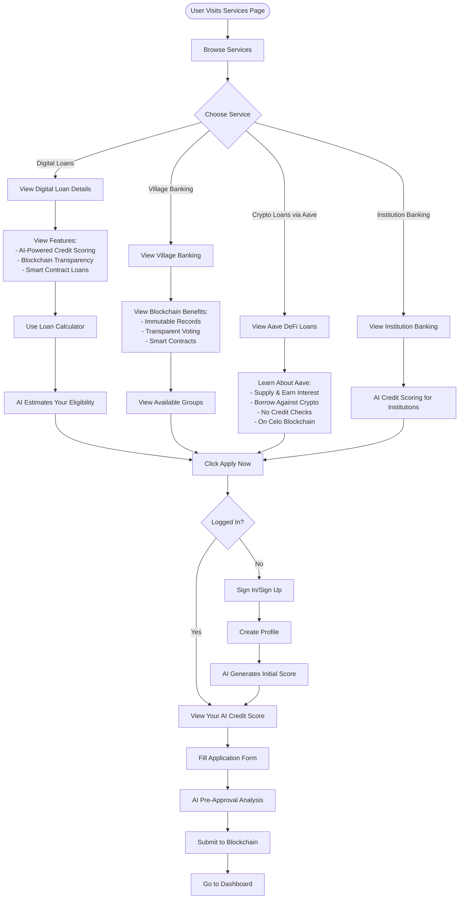

## Dashboard User Flow

```mermaid
flowchart TD
    Start([User Logs In]) --> Dashboard[Dashboard Home]
    Dashboard --> ViewCreditScore[View AI Credit Score Widget]
    ViewCreditScore --> Dashboard
    
    Dashboard --> ChooseAction{What to Do?}
    
    %% Personal Savings Flow
    ChooseAction -->|Manage Savings| Savings[Personal Savings]
    Savings --> SavingsAction{Action}
    SavingsAction -->|Create Goal| NewGoal[Create Savings Goal]
    SavingsAction -->|Add Funds| AddFunds[Add Money to Goal]
    SavingsAction -->|View Progress| ViewProgress[Check Progress]
    NewGoal --> Dashboard
    AddFunds --> Dashboard
    ViewProgress --> Dashboard
    
    %% Groups Flow
    ChooseAction -->|Groups| Groups[Village Banking Groups]
    Groups --> GroupAction{Action}
    GroupAction -->|View My Groups| ViewGroup[View Group Details]
    GroupAction -->|Create Group| CreateGroup[Create New Group]
    GroupAction -->|Join Group| JoinGroup[Join Existing Group]
    
    ViewGroup --> GroupDetail[See Members & Contributions]
    GroupDetail --> Contribute[Make Contribution]
    Contribute --> Dashboard
    
    CreateGroup --> SetupGroup[Configure Group Settings]
    SetupGroup --> InviteMembers[Invite Members]
    InviteMembers --> Dashboard
    
    JoinGroup --> FindGroup[Browse or Enter Code]
    FindGroup --> RequestJoin[Request to Join]
    RequestJoin --> Dashboard
    
    %% Loans Flow
    ChooseAction -->|Loans| Loans[Loans]
    Loans --> CheckCreditScore[View AI Credit Score & Recommendations]
    CheckCreditScore --> LoanAction{Action}
    LoanAction -->|Request Loan| RequestLoan[Request Group Loan]
    LoanAction -->|Vote on Loan| VoteLoan[Vote on Pending Loans]
    LoanAction -->|View My Loans| MyLoans[View My Loan Status]
    LoanAction -->|DeFi Loan via Aave| AaveLoan[Explore Aave DeFi Loans]
    
    RequestLoan --> LoanForm[Fill Loan Details]
    LoanForm --> AIAnalysis[AI Analyzes Creditworthiness]
    AIAnalysis --> AIRecommendation[Get AI Loan Recommendation]
    AIRecommendation --> SubmitLoan[Submit Request to Blockchain]
    SubmitLoan --> BlockchainRecord[Record on Celo Blockchain]
    BlockchainRecord --> WaitVote[Wait for Group Votes]
    WaitVote --> LoanApproved{Approved?}
    LoanApproved -->|Yes| SmartContract[Create Smart Contract]
    SmartContract --> GetFunds[Receive Funds via Celo]
    LoanApproved -->|No| Dashboard
    GetFunds --> Repay[Make Repayments on Chain]
    Repay --> UpdateScore[AI Score Updates]
    UpdateScore --> Dashboard
    
    AaveLoan --> ConnectCelo[Connect Celo Wallet]
    ConnectCelo --> ViewAave[View Aave Lending Pools]
    ViewAave --> DepositCollateral[Deposit Crypto Collateral]
    DepositCollateral --> BorrowAave[Borrow via Aave]
    BorrowAave --> Dashboard
    
    VoteLoan --> ReviewLoan[Review Loan Request]
    ReviewLoan --> CastVote[Cast Vote & Comment]
    CastVote --> Dashboard
    
    MyLoans --> CheckStatus[Check Loan Status]
    CheckStatus --> Dashboard
    
    %% Payments Flow
    ChooseAction -->|Payments| Payments[Payments]
    Payments --> PaymentAction{Action}
    PaymentAction -->|Send Money| SendMoney[Send Money]
    PaymentAction -->|Request Money| RequestMoney[Request Money]
    PaymentAction -->|Pay Bill| PayBill[Pay Bill]
    
    SendMoney --> EnterDetails[Enter Recipient & Amount]
    EnterDetails --> ConfirmPay[Confirm Payment]
    ConfirmPay --> PaySuccess[Payment Successful]
    PaySuccess --> Dashboard
    
    RequestMoney --> RequestDetails[Enter Request Details]
    RequestDetails --> SendRequest[Send Request]
    SendRequest --> Dashboard
    
    PayBill --> SelectBill[Select Bill & Amount]
    SelectBill --> ConfirmPay
    
    %% Deposit/Withdraw Flow
    ChooseAction -->|Deposit/Withdraw| DepositWithdraw[Deposit or Withdraw]
    DepositWithdraw --> DWAction{Action}
    DWAction -->|Deposit| Deposit[Deposit Money]
    DWAction -->|Withdraw| Withdraw[Withdraw Money]
    
    Deposit --> DepositMethod[Choose Method: Mobile Money, Bank, Crypto]
    DepositMethod --> DepositAmount[Enter Amount]
    DepositAmount --> DepositConfirm[Complete Deposit]
    DepositConfirm --> Dashboard
    
    Withdraw --> WithdrawMethod[Choose Method]
    WithdrawMethod --> WithdrawAmount[Enter Amount]
    WithdrawAmount --> WithdrawConfirm[Complete Withdrawal]
    WithdrawConfirm --> Dashboard
    
    %% View Balances Flow
    ChooseAction -->|Check Balances| Balances[View Balances]
    Balances --> ViewBalance{View}
    ViewBalance -->|Personal| PersonalBal[Personal Wallet Balance]
    ViewBalance -->|Groups| GroupBal[All Group Balances]
    ViewBalance -->|Savings| SavingsBal[Savings Goals Balance]
    ViewBalance -->|Crypto| CryptoBal[Crypto Wallet Balance]
    ViewBalance -->|Aave Positions| AavePositions[Aave DeFi Positions]
    
    CryptoBal --> CryptoConnected{Wallet Connected?}
    CryptoConnected -->|No| ConnectWallet[Connect Celo Wallet]
    CryptoConnected -->|Yes| ViewCrypto[View CELO, cUSD, cEUR]
    ConnectWallet --> ViewCrypto
    ViewCrypto --> CeloActions[Celo Blockchain Actions]
    CeloActions --> Dashboard
    
    AavePositions --> ViewAaveBalance[View Supplied & Borrowed]
    ViewAaveBalance --> Dashboard
    
    PersonalBal --> Dashboard
    GroupBal --> Dashboard
    SavingsBal --> Dashboard
    
    %% Notifications Flow
    ChooseAction -->|Check Notifications| Notifications[Notifications]
    Notifications --> ViewNotif[View All Notifications]
    ViewNotif --> NotifAction[Click Notification]
    NotifAction --> TakeAction[Take Action or Mark Read]
    TakeAction --> Dashboard
    
    %% Settings Flow
    ChooseAction -->|Settings| Settings[Settings]
    Settings --> SettingOption{What to Change?}
    SettingOption -->|Profile| EditProfile[Edit Profile Info]
    SettingOption -->|Language| ChangeLanguage[Change Language]
    SettingOption -->|Theme| ToggleTheme[Toggle Dark/Light Mode]
    SettingOption -->|Security| Security[Security Settings]
    
    EditProfile --> SaveChanges[Save Changes]
    SaveChanges --> Dashboard
    ChangeLanguage --> Dashboard
    ToggleTheme --> Dashboard
    Security --> Dashboard
```

## Quick Actions Flow (From Dashboard)

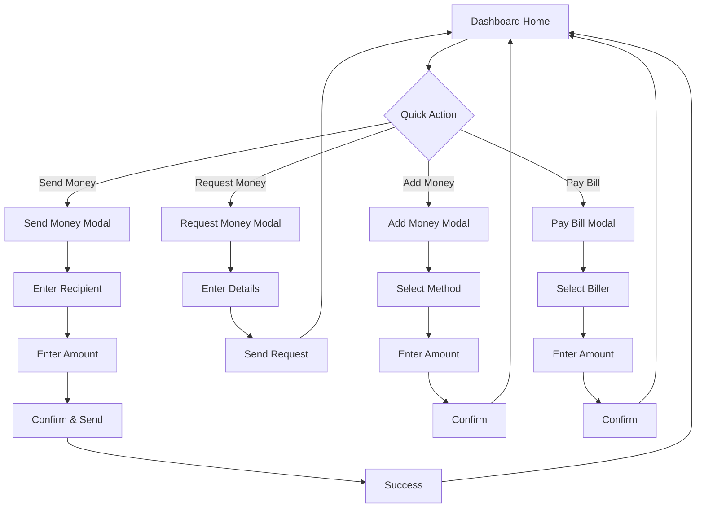

## Complete User Journey Map

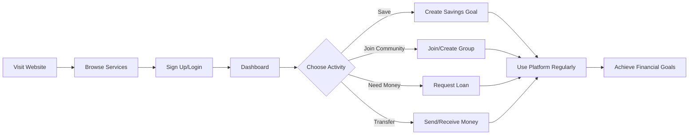

## Loan Request Journey (with AI Credit Scoring)

```mermaid
flowchart LR
    A[Need Money] --> B[Go to Loans Page]
    B --> C[View AI Credit Score]
    C --> D[Click New Loan Request]
    D --> E[Select Group]
    E --> F[Enter Amount & Purpose]
    F --> G[AI Analyzes Request]
    G --> H[Get Credit Assessment]
    H --> I[Set Repayment Terms]
    I --> J[Submit Request]
    J --> K[Recorded on Celo Blockchain]
    K --> L[Group Members Vote]
    L --> M{Vote Result}
    M -->|Approved| N[Smart Contract Created]
    N --> O[Receive Funds via Celo]
    M -->|Rejected| P[AI Suggests Improvements]
    O --> Q[Make Repayments]
    Q --> R[Payment Recorded on Chain]
    R --> S[AI Score Improves]
    S --> T[Loan Complete]
```

## Village Banking Journey

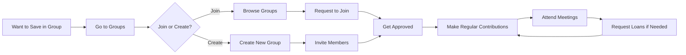

## Savings Goal Journey

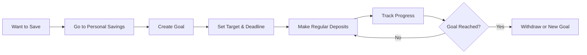

---

## Key User Paths Summary

### 1. **New User → First Loan**
Visit Website → Browse Services → Sign Up → Dashboard → Loans → Request Loan → Get Approved → Receive Funds

### 2. **New User → Join Village Banking**
Visit Website → Sign Up → Dashboard → Groups → Browse Groups → Request to Join → Get Approved → Make Contributions

### 3. **Regular User → Daily Activity**
Login → Dashboard → Check Balances → View Notifications → Make Payment → Send Money → Check Savings Goals

### 4. **Group Member → Request Loan**
Dashboard → Loans → New Request → Select Group → Enter Details → Submit → Wait for Votes → Get Funds → Repay

### 5. **Group Member → Vote on Loan**
Dashboard → Notifications (New Loan Request) → Click Notification → Review Loan → Cast Vote → Done

### 6. **User → Manage Savings**
Dashboard → Personal Savings → Create Goal → Add Funds → Track Progress → Reach Goal

### 7. **User → DeFi Lending via Aave**
Dashboard → View Balances → Crypto Wallet → Connect Celo → Aave Pools → Supply Crypto → Earn Interest

### 8. **User → DeFi Borrowing via Aave**
Dashboard → Loans → Aave DeFi → Supply Collateral → Borrow Assets → Monitor Health Factor → Repay

### 9. **Credit Score Improvement Journey**
Make Deposits → Timely Contributions → On-time Repayments → AI Score Increases → Better Loan Terms → Higher Limits

---

## Complete Loan Flow with AI & Blockchain

```mermaid
flowchart TD
    Start([User Needs Loan]) --> CheckScore[Check AI Credit Score on Dashboard]
    CheckScore --> ScoreDisplay[Score: 300-850<br/>Score Factors Shown<br/>Improvement Tips]
    
    ScoreDisplay --> InitiateLoan[Click Request Loan]
    InitiateLoan --> ChooseLoanType{Loan Type}
    
    ChooseLoanType -->|Group Loan| GroupLoan[Group Village Banking Loan]
    ChooseLoanType -->|DeFi Loan| DeFiLoan[Aave DeFi Loan]
    
    %% Group Loan Path
    GroupLoan --> SelectGroup[Select Village Banking Group]
    SelectGroup --> FillDetails[Fill Loan Details:<br/>- Amount<br/>- Purpose<br/>- Repayment Terms]
    FillDetails --> AIAnalysis[AI Analyzes Request]
    
    AIAnalysis --> AIFactors[AI Considers:<br/>- Credit Score<br/>- Payment History<br/>- Group Standing<br/>- Debt-to-Income<br/>- Blockchain History]
    
    AIFactors --> AIRecommendation[AI Generates Recommendation]
    AIRecommendation --> ScoreImpact{Credit Score}
    
    ScoreImpact -->|700+| HighScore[AI Recommends APPROVAL<br/>Suggested Interest: 4-5%]
    ScoreImpact -->|550-699| MedScore[AI Recommends REVIEW<br/>Suggested Interest: 6-8%]
    ScoreImpact -->|<550| LowScore[AI Flags for SCRUTINY<br/>Suggested Interest: 10%+]
    
    HighScore --> SubmitToBlockchain
    MedScore --> SubmitToBlockchain
    LowScore --> SubmitToBlockchain
    
    SubmitToBlockchain[Submit to Celo Blockchain]
    SubmitToBlockchain --> CreateTx[Create Transaction on Celo]
    CreateTx --> BlockchainRecord[Immutable Record Created:<br/>- Loan Request ID<br/>- Timestamp<br/>- Amount & Terms<br/>- AI Score at Time<br/>- Hash]
    
    BlockchainRecord --> NotifyGroup[Notify Group Members]
    NotifyGroup --> DisplayAI[Show AI Recommendation to Voters]
    DisplayAI --> MemberVote[Members Vote with AI Context]
    
    MemberVote --> VoteOnChain[Votes Recorded on Blockchain]
    VoteOnChain --> TallyVotes[Tally Votes via Smart Contract]
    TallyVotes --> VoteResult{Result}
    
    VoteResult -->|Approved| CreateSmartContract[Create Loan Smart Contract]
    VoteResult -->|Rejected| RecordRejection[Record Rejection on Chain]
    
    CreateSmartContract --> ContractTerms[Smart Contract Contains:<br/>- Borrower Address<br/>- Amount<br/>- Interest Rate<br/>- Repayment Schedule<br/>- Auto-execute Penalties]
    
    ContractTerms --> DisburseFunds[Disburse Funds via Celo]
    DisburseFunds --> FundsInWallet[Funds in User's Celo Wallet]
    FundsInWallet --> ConvertCurrency[Convert cUSD to Fiat if Needed]
    
    ConvertCurrency --> RepaymentPhase[Repayment Phase Begins]
    RepaymentPhase --> RepaymentOptions{Payment Status}
    
    RepaymentOptions -->|On Time| OnTimePayment[Make On-Time Payment]
    RepaymentOptions -->|Late| LatePayment[Late Payment Penalty]
    RepaymentOptions -->|Missed| MissedPayment[Missed Payment]
    
    OnTimePayment --> PaymentToChain[Record Payment on Blockchain]
    PaymentToChain --> SmartContractUpdate[Smart Contract Updates]
    SmartContractUpdate --> AIScoreIncrease[AI Score Increases +10 to +50]
    AIScoreIncrease --> ScoreOnChain[New Score Recorded on Chain]
    ScoreOnChain --> ContinuePayments{Loan Paid Off?}
    
    LatePayment --> LatePenalty[Late Fee Applied by Smart Contract]
    LatePenalty --> AIScoreDecrease[AI Score Decreases -20]
    AIScoreDecrease --> PaymentToChain
    
    MissedPayment --> MissedPenalty[Missed Payment Penalty]
    MissedPenalty --> AIScoreDrop[AI Score Drops -50 to -100]
    AIScoreDrop --> AlertGroup[Alert Group Members]
    AlertGroup --> PaymentToChain
    
    ContinuePayments -->|No| RepaymentPhase
    ContinuePayments -->|Yes| LoanComplete[Loan Fully Repaid]
    
    LoanComplete --> FinalBlockchainUpdate[Final Update on Blockchain]
    FinalBlockchainUpdate --> ReleaseCollateral[Release Any Collateral]
    ReleaseCollateral --> MajorScoreBoost[AI Score Boost +100 to +200]
    MajorScoreBoost --> UnlockBenefits[Unlock Benefits:<br/>- Lower Rates for Next Loan<br/>- Higher Limits<br/>- Premium Features]
    UnlockBenefits --> BuildCreditHistory[Verifiable Credit History on Chain]
    
    RecordRejection --> AIFeedback[AI Provides Feedback:<br/>- Why Rejected<br/>- How to Improve<br/>- Alternative Options]
    AIFeedback --> MinorScorePenalty[Minor Score Impact -10]
    MinorScorePenalty --> TryAgain[Improve & Try Again]
    
    %% DeFi Loan Path
    DeFiLoan --> ConnectCeloWallet[Connect Celo Wallet]
    ConnectCeloWallet --> ViewAavePools[View Aave Lending Pools]
    ViewAavePools --> SelectCollateral[Select Crypto Collateral]
    SelectCollateral --> DepositCollateral[Deposit Collateral to Aave]
    DepositCollateral --> CheckBorrowPower[Check Borrowing Power]
    CheckBorrowPower --> SelectBorrowAsset[Select Asset to Borrow]
    SelectBorrowAsset --> BorrowFromAave[Borrow from Aave Pool]
    BorrowFromAave --> AaveSmartContract[Aave Smart Contract Executes]
    AaveSmartContract --> ReceiveBorrowedFunds[Receive Borrowed Funds]
    ReceiveBorrowedFunds --> MonitorHealth[Monitor Health Factor]
    MonitorHealth --> RepayAave[Repay to Aave When Ready]
    RepayAave --> ReclaimCollateral[Reclaim Collateral]
    ReclaimCollateral --> AIScoreAave[DeFi Activity Improves AI Score]
    AIScoreAave --> BuildCreditHistory
```

---

## AI Credit Scoring Flow

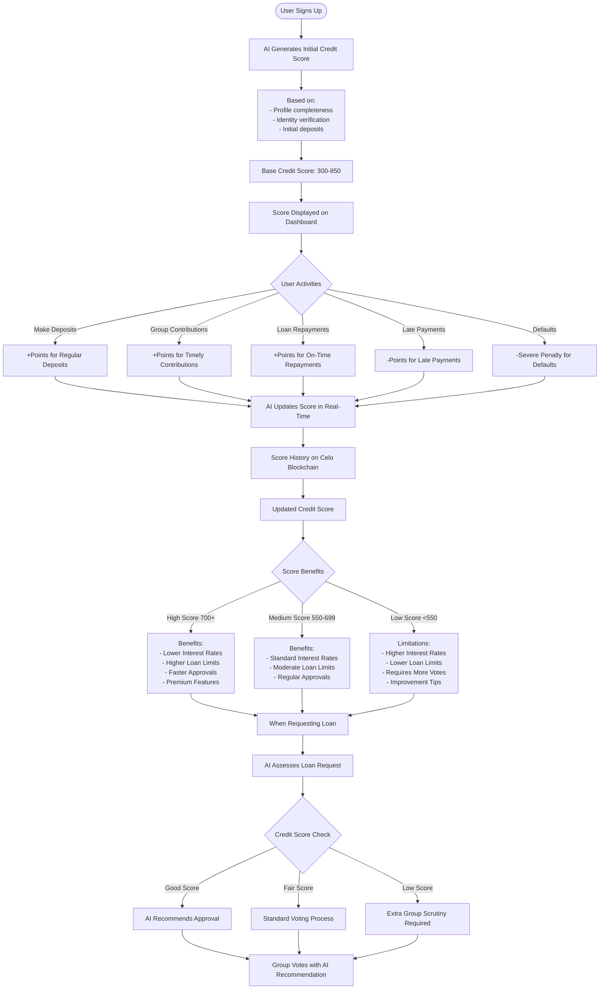

## Celo Blockchain Integration Flow

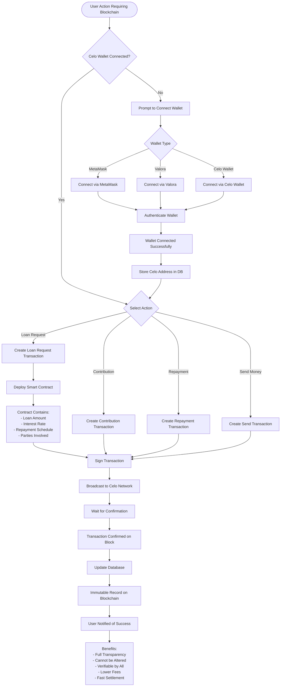

## Aave DeFi Integration Flow

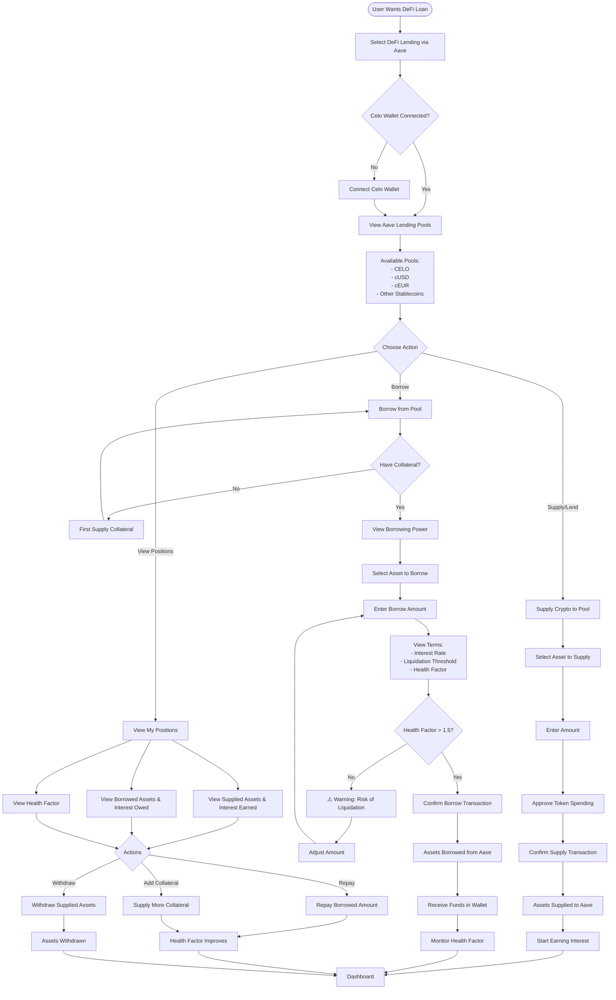

## AI Credit Score Factors

### Positive Factors (Increase Score)
1. **Payment History (35%)**
   - On-time loan repayments
   - Regular group contributions
   - Consistent deposits

2. **Credit Utilization (30%)**
   - Low loan-to-savings ratio
   - Multiple active savings goals
   - Diversified financial activities

3. **Account Age (15%)**
   - Length of time on platform
   - Consistent activity over time
   - Long-term memberships

4. **Financial Behavior (10%)**
   - Group participation
   - Meeting attendance
   - Helping other members (votes)

5. **Blockchain Verification (10%)**
   - Verified transactions on-chain
   - Smart contract compliance
   - Transparent financial history

### Negative Factors (Decrease Score)
1. **Late Payments** (-50 to -100 points)
2. **Defaults** (-150 to -300 points)
3. **Missed Group Contributions** (-20 to -50 points)
4. **High Debt-to-Income Ratio** (limits increases)
5. **Recent Loan Rejections** (-10 points)

## Blockchain Benefits

### For Users
- **Transparency**: All transactions visible and verifiable
- **Security**: Immutable records prevent fraud
- **Lower Fees**: No intermediaries
- **Fast Settlement**: Near-instant confirmations
- **Accessibility**: Financial services for unbanked
- **Portable Credit**: Credit history moves with you

### For Groups
- **Trust**: Cannot manipulate records
- **Automation**: Smart contracts auto-execute
- **Reduced Disputes**: Clear transaction history
- **Compliance**: Automatic record-keeping
- **Governance**: On-chain voting mechanisms

## Aave Benefits

### As a Lender (Supplying)
- **Earn Passive Income**: Interest on supplied assets
- **Flexible Withdrawals**: Remove funds anytime
- **Low Risk**: Overcollateralized system
- **Multiple Assets**: Support for various tokens

### As a Borrower
- **Keep Your Crypto**: Don't sell during market dips
- **No Credit Checks**: DeFi is permissionless
- **Competitive Rates**: Market-driven interest rates
- **Flexible Repayment**: Pay back when you want
- **Flash Loans**: Advanced DeFi strategies

## System Integration Architecture

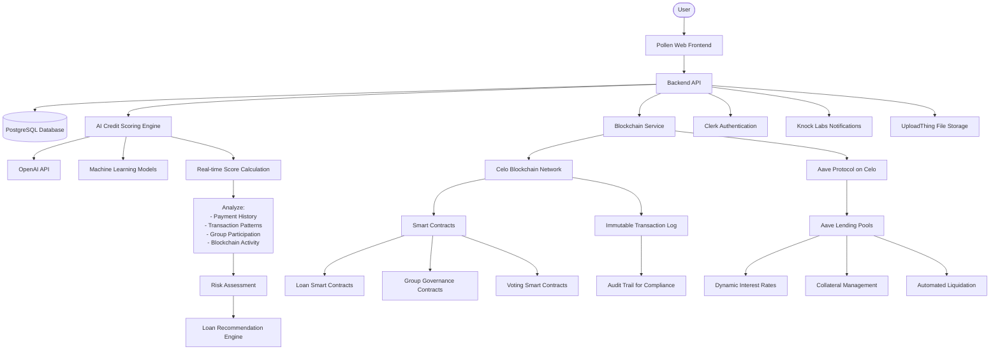

## AI Credit Score Calculation Method

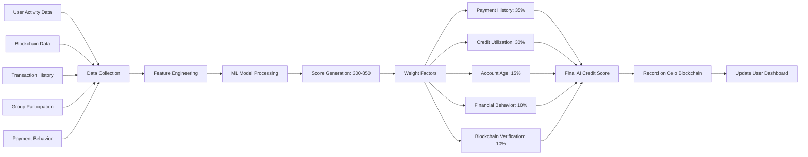

## Smart Contract Loan Lifecycle

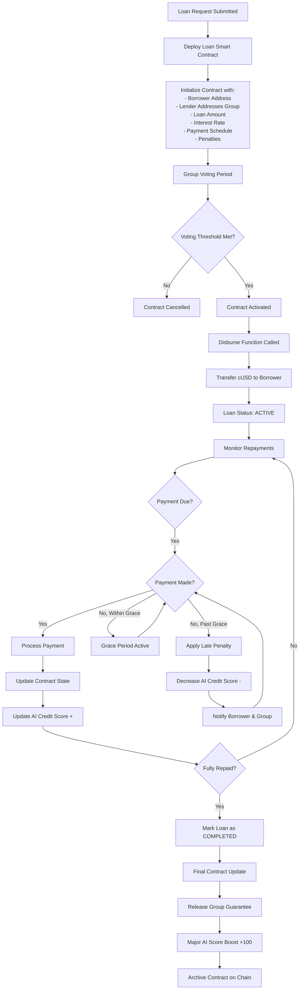

## Aave Integration Technical Flow

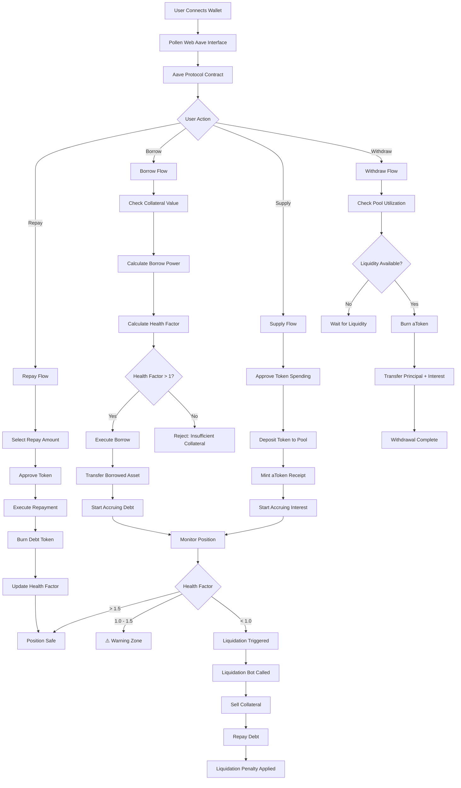

## Data Flow: AI Score Update

1. **Event Occurs** (Payment made, contribution added, etc.)
2. **Captured in Database** (PostgreSQL records transaction)
3. **Blockchain Verification** (Transaction confirmed on Celo)
4. **AI Engine Triggered** (Event listener activates)
5. **Factor Analysis** (Analyze impact on credit score)
6. **Score Calculation** (ML model processes data)
7. **New Score Generated** (Updated score: 300-850)
8. **Blockchain Recording** (New score hash stored on-chain)
9. **Database Update** (PostgreSQL updated with new score)
10. **User Notification** (Real-time notification via Knock Labs)
11. **Dashboard Refresh** (UI updates with new score)

## Security & Privacy

### AI Credit Scoring
- **Privacy-Preserving**: Only aggregated metrics stored on-chain
- **Transparent Factors**: Users see what affects their score
- **Appeal Process**: Users can dispute incorrect data
- **Regular Audits**: ML model fairness checks

### Blockchain Security
- **Encryption**: Sensitive data encrypted before storage
- **Access Control**: Role-based permissions
- **Immutability**: Transaction history cannot be altered
- **Verification**: All parties can verify transactions

### Aave Integration
- **Non-Custodial**: Users control their keys
- **Smart Contract Audits**: Aave contracts are audited
- **Oracle Security**: Chainlink price feeds used
- **Automated Risk Management**: Liquidations prevent bad debt

## Mobile vs Desktop Navigation

### Mobile
- Bottom Navigation Bar
- Hamburger Menu
- Floating Action Button (FAB)
- Swipeable Cards

### Desktop
- Left Sidebar (Always Visible)
- Top Navigation Bar
- Dropdown Menus
- Grid Layouts

---

## Key Features Summary

### 🤖 AI Credit Scoring
- **Real-time Score Updates**: Score updates immediately after activities
- **Transparent Factors**: Users see exactly what affects their score
- **Personalized Recommendations**: AI suggests optimal loan amounts and terms
- **Risk Assessment**: Automated risk analysis for loan requests
- **Score Range**: 300-850 (similar to traditional FICO scores)
- **Blockchain Verified**: Score history immutably stored on-chain
- **Improvement Path**: Clear guidance on how to improve score

### ⛓️ Celo Blockchain Integration
- **Immutable Records**: All transactions permanently recorded
- **Smart Contracts**: Automated loan execution and repayment
- **Transparency**: Full transaction visibility for all parties
- **Low Fees**: Minimal gas fees on Celo network
- **Fast Settlement**: Near-instant transaction confirmation
- **Mobile-First**: Optimized for mobile money integration
- **Stablecoin Support**: cUSD and cEUR for price stability
- **Governance**: On-chain voting for group decisions

### 🏦 Aave DeFi Integration
- **Decentralized Lending**: Permissionless borrowing and lending
- **Earn Interest**: Supply crypto and earn passive income
- **Borrow Against Crypto**: Keep crypto while accessing liquidity
- **No Credit Checks**: DeFi is permissionless and accessible to all
- **Flexible Terms**: Borrow and repay on your schedule
- **Multiple Assets**: Support for CELO, cUSD, cEUR, and more
- **Risk Management**: Automated liquidations protect the protocol
- **Health Factor Monitoring**: Real-time position health tracking
- **Flash Loans**: Advanced DeFi strategies for power users

### 💡 Innovation Benefits
1. **Financial Inclusion**: Serve the unbanked with blockchain identity
2. **Credit Building**: Build verifiable credit history on-chain
3. **Lower Costs**: Blockchain reduces intermediary fees
4. **Faster Processing**: Automated smart contracts speed up approvals
5. **Global Access**: Borderless financial services
6. **Data Ownership**: Users control their financial data
7. **Fraud Prevention**: Immutable records prevent manipulation
8. **Community Trust**: Transparent operations build confidence

### 🎯 User Benefits
- **Better Rates**: High credit scores = lower interest rates
- **Higher Limits**: Proven track record = larger loan amounts
- **Instant Approvals**: AI pre-approval speeds up process
- **Multiple Options**: Traditional groups + DeFi lending
- **Portable Credit**: Blockchain credit moves with you
- **Passive Income**: Earn interest on crypto holdings
- **Financial Education**: AI provides personalized tips
- **Community Support**: Village banking + modern tech

---

## Technology Stack

### Frontend
- Next.js 16
- React 19
- TypeScript
- Tailwind CSS
- Framer Motion

### Backend
- Next.js API Routes
- PostgreSQL (Neon)
- Prisma ORM
- Clerk Authentication

### AI/ML
- OpenAI API
- Custom ML Models
- Real-time Scoring Engine
- Sentiment Analysis

### Blockchain
- Celo Network
- Solidity Smart Contracts
- Ethers.js
- ContractKit

### DeFi
- Aave Protocol v3
- Lending Pools
- Flash Loans
- Liquidation Engine

### Integrations
- Knock Labs (Notifications)
- Vapi AI (Voice Navigation)
- UploadThing (File Storage)
- Mobile Money APIs

---

## Future Enhancements

### AI Features
- **Predictive Analytics**: Forecast loan repayment probability
- **Personalized Offers**: Tailored loan products based on behavior
- **Fraud Detection**: AI-powered fraud prevention
- **Chatbot Support**: AI assistant for financial advice

### Blockchain Features
- **Cross-Chain Support**: Expand to Ethereum, Polygon, etc.
- **NFT Collateral**: Use NFTs as loan collateral
- **DAO Governance**: Decentralized platform governance
- **Yield Farming**: Additional DeFi earning strategies

### DeFi Features
- **More Protocols**: Integrate Compound, Uniswap, etc.
- **Liquidity Mining**: Earn rewards for providing liquidity
- **Staking**: Stake platform tokens for benefits
- **Insurance**: DeFi insurance for loan protection

---

This comprehensive user flow now includes **AI Credit Scoring**, **Celo Blockchain**, and **Aave DeFi** integration throughout the platform! 🚀

