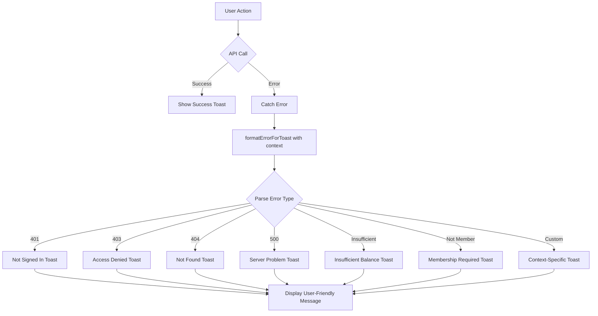

# ViewBalances Error Handling Improvement

## Overview

Enhanced the `ViewBalances.tsx` component to provide clear, user-friendly error messages through toast notifications instead of technical error messages that users don't understand.

## Changes Made

### 1. **Added Error Handling Library Import**

```typescript
import { formatErrorForToast } from '@/lib/error-messages'
```

### 2. **Improved Balance Fetching Error Handling**

**Before:**
```typescript
const { data: balanceData, isLoading } = useQuery<BalanceData>({
  queryKey: ['balances'],
  queryFn: async () => {
    const response = await fetch('/api/balances')
    if (!response.ok) {
      throw new Error('Failed to fetch balances');
    }
    return response.json()
  }
})
```

**After:**
```typescript
const { data: balanceData, isLoading, error: balanceError } = useQuery<BalanceData>({
  queryKey: ['balances'],
  queryFn: async () => {
    try {
      const response = await fetch('/api/balances')
      if (!response.ok) {
        // Parse error from API response
        const contentType = response.headers.get("content-type");
        if (contentType && contentType.includes("application/json")) {
          const errorData = await response.json();
          throw new Error(errorData.message || 'Failed to fetch balances');
        } else {
          const errorText = await response.text();
          throw new Error(errorText || 'Failed to fetch balances');
        }
      }
      return await response.json()
    } catch (err) {
      // Show user-friendly error toast
      const errorInfo = formatErrorForToast(err, 'balance-fetch');
      toast.error(errorInfo.title, {
        description: errorInfo.description
      });
      throw err;
    }
  },
  retry: 1,
  retryDelay: 1000
})
```

### 3. **Enhanced Contribution Error Handling**

**Before:**
```typescript
const makeContribution = useMutation({
  mutationFn: async ({ groupId, amount }) => {
    const response = await fetch(`/api/groups/${groupId}/contribute`, {...})
    if (!response.ok) throw new Error('Failed to make contribution')
    return response.json()
  },
  onSuccess: () => {
    toast.success('Contribution made successfully')
  },
  onError: (error) => {
    toast.error(error.message) // ❌ Technical message
  }
})
```

**After:**
```typescript
const makeContribution = useMutation({
  mutationFn: async ({ groupId, amount }) => {
    const response = await fetch(`/api/groups/${groupId}/contribute`, {...})
    
    if (!response.ok) {
      // Parse error details from API
      const contentType = response.headers.get("content-type");
      if (contentType && contentType.includes("application/json")) {
        const errorData = await response.json();
        throw new Error(errorData.message || errorData.error || 'Failed to make contribution');
      } else {
        const errorText = await response.text();
        throw new Error(errorText || 'Failed to make contribution');
      }
    }
    
    return response.json()
  },
  onSuccess: () => {
    toast.success('Contribution Successful', {
      description: 'Your contribution has been added to the group successfully.'
    })
  },
  onError: (error) => {
    const errorInfo = formatErrorForToast(error, 'contribution');
    toast.error(errorInfo.title, {
      description: errorInfo.description
    }) // ✅ User-friendly message
  }
})
```

### 4. **Improved Form Validation Messages**

**Before:**
```typescript
const handleContribution = () => {
  if (!selectedGroup || !contributionAmount) return
  const amount = parseFloat(contributionAmount)
  if (isNaN(amount) || amount <= 0) {
    toast.error('Please enter a valid amount') // ❌ Generic
    return
  }
  makeContribution.mutate({ groupId: selectedGroup.id, amount })
}
```

**After:**
```typescript
const handleContribution = () => {
  // Check if group and amount are selected
  if (!selectedGroup || !contributionAmount) {
    toast.error('Missing Information', {
      description: 'Please select a group and enter a contribution amount.'
    })
    return
  }
  
  const amount = parseFloat(contributionAmount)
  
  // Validate amount
  if (isNaN(amount) || amount <= 0) {
    toast.error('Invalid Amount', {
      description: 'Please enter a valid positive amount for your contribution.'
    })
    return
  }
  
  // Check sufficient balance
  if (balanceData?.walletBalance && amount > balanceData.walletBalance) {
    toast.error('Insufficient Balance', {
      description: `You need K ${amount.toFixed(2)} but only have K ${balanceData.walletBalance.toFixed(2)} in your wallet.`
    })
    return
  }
  
  makeContribution.mutate({ groupId: selectedGroup.id, amount })
}
```

### 5. **Extended Error Messages Library**

Added two new error handler functions in `lib/error-messages.ts`:

#### **getBalanceFetchError()**
Handles balance-related fetch errors:
- Wallet not found → "Your wallet hasn't been set up yet"
- Balance unavailable → "We couldn't fetch your current balance"

#### **getContributionError()**
Handles contribution-specific errors:
- Group not found → "The group no longer exists or you don't have access"
- Not a member → "You must be an active member to make contributions"
- Insufficient balance → "You don't have enough funds in your wallet"
- Invalid amount → "The contribution amount is invalid"
- Membership inactive → "Your membership is not active"

#### **Updated ErrorContext Type**
```typescript
export type ErrorContext = 'loan' | 'vote' | 'group' | 'fetch' | 'balance-fetch' | 'contribution'
```

## User Experience Improvements

### Before ❌
```
Error: Failed to fetch balances
Error: 500
Error: Please enter a valid amount
```

### After ✅
```
🔴 Balance Unavailable
   We couldn't fetch your current balance. Please try again. • Refresh the page

🔴 Insufficient Balance
   You need K 500.00 but only have K 250.00 in your wallet. • Add funds to continue

🔴 Not a Member
   You must be an active member of this group to make contributions. • Join the group first
```

## Error Handling Flow



## Validation Checks Added

### Client-Side Validations
1. ✅ **Missing Information**: Check if group and amount are provided
2. ✅ **Invalid Amount**: Check if amount is a valid positive number
3. ✅ **Insufficient Balance**: Check if user has enough funds before API call

### Benefits
- **Faster Feedback**: Users see errors immediately without waiting for API
- **Reduced API Calls**: Invalid requests are caught before sending
- **Better UX**: Clear, actionable error messages with specific amounts

## Toast Notification Examples

### Balance Fetch Error
```typescript
toast.error('Balance Unavailable', {
  description: 'We couldn\'t fetch your current balance. Please try again. • Refresh the page'
})
```

### Contribution Validation Error
```typescript
toast.error('Insufficient Balance', {
  description: 'You need K 500.00 but only have K 250.00 in your wallet. • Add funds to continue'
})
```

### Contribution Success
```typescript
toast.success('Contribution Successful', {
  description: 'Your contribution has been added to the group successfully.'
})
```

### Membership Error
```typescript
toast.error('Not a Member', {
  description: 'You must be an active member of this group to make contributions. • Join the group first'
})
```

## API Error Parsing

### Handles Multiple Response Types
```typescript
// JSON responses
if (contentType && contentType.includes("application/json")) {
  const errorData = await response.json();
  throw new Error(errorData.message || errorData.error || 'Default message');
}

// Text/HTML responses
else {
  const errorText = await response.text();
  throw new Error(errorText || 'Default message');
}
```

### Extracts User-Friendly Messages
- Checks for `error.message` field
- Checks for `error.error` field
- Falls back to generic message if neither exists

## Testing Scenarios

### 1. Balance Fetch Failures
- ❌ Network error → "Connection Problem"
- ❌ Wallet not found → "Wallet Not Found"
- ❌ Server error (500) → "Server Problem"
- ❌ Unauthorized (401) → "Not Signed In"

### 2. Contribution Failures
- ❌ Insufficient funds → "Insufficient Balance" with exact amounts
- ❌ Not a member → "Not a Member"
- ❌ Group not found → "Group Not Found"
- ❌ Invalid amount → "Invalid Amount"
- ❌ Membership inactive → "Membership Inactive"

### 3. Form Validations
- ❌ Empty amount → "Missing Information"
- ❌ Negative amount → "Invalid Amount"
- ❌ Amount > wallet balance → "Insufficient Balance" (client-side check)

### 4. Success Cases
- ✅ Contribution successful → "Contribution Successful"
- ✅ Balance refreshed → Data updates without toast

## Files Modified

1. **`components/ViewBalances.tsx`**
   - Added `formatErrorForToast` import
   - Enhanced balance fetch error handling with try-catch
   - Improved contribution mutation error handling
   - Added client-side validation in `handleContribution`
   - Added retry logic for balance fetching

2. **`lib/error-messages.ts`**
   - Added `ErrorContext` type export
   - Added `getBalanceFetchError()` function
   - Added `getContributionError()` function
   - Updated `formatErrorForToast()` to accept new contexts

## Benefits Summary

### For Users ✅
- **Clear Messages**: Understand what went wrong
- **Actionable Steps**: Know what to do next
- **No Technical Jargon**: No status codes or stack traces
- **Faster Resolution**: Can fix issues themselves

### For Developers ✅
- **Centralized Error Handling**: One place to manage all error messages
- **Consistent UX**: Same error format across the app
- **Easy to Extend**: Add new contexts as needed
- **Type-Safe**: TypeScript ensures correct context usage

### For Support ✅
- **Fewer Questions**: Users understand errors without help
- **Better Reports**: Users can describe issues clearly
- **Reduced Load**: Less support tickets for unclear errors

## Example User Flows

### Flow 1: Insufficient Balance
```
1. User enters K 500 contribution
2. Clicks "Contribute" button
3. Client checks: wallet has K 250
4. Toast appears: "Insufficient Balance
   You need K 500.00 but only have K 250.00 in your wallet.
   • Add funds to continue"
5. User knows exact amount needed
6. User adds funds before retrying
```

### Flow 2: API Error
```
1. User selects group and enters amount
2. Clicks "Contribute" button
3. API returns 404 (group deleted)
4. Toast appears: "Group Not Found
   The group you're trying to contribute to no longer exists.
   • Select a different group"
5. User understands group is gone
6. User selects different group
```

### Flow 3: Success
```
1. User enters valid contribution
2. Clicks "Contribute" button
3. API processes successfully
4. Toast appears: "Contribution Successful
   Your contribution has been added to the group successfully."
5. Balance updates automatically
6. Input field clears
7. User sees updated group balance
```

## Implementation Status

- ✅ Balance fetch error handling
- ✅ Contribution error handling
- ✅ Form validation messages
- ✅ Client-side balance check
- ✅ Success toast improvements
- ✅ Error context types
- ✅ Balance-specific errors
- ✅ Contribution-specific errors
- ✅ API response parsing
- ✅ TypeScript type safety

## Next Steps (Optional)

1. **Add Loading States**: Show skeleton loaders during mutations
2. **Add Confirmation Dialogs**: Confirm large contributions
3. **Add Transaction History**: Show recent contributions in UI
4. **Add Optimistic Updates**: Update UI before API confirms
5. **Add Undo Feature**: Allow users to cancel recent contributions

---

**Status**: ✅ Complete and Working  
**Date**: December 2024  
**Component**: `components/ViewBalances.tsx`  
**Error Library**: `lib/error-messages.ts`

